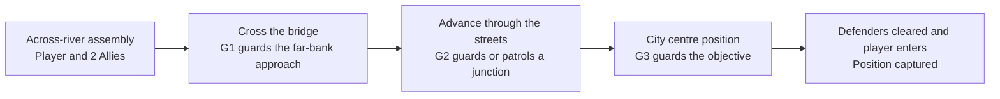

# Paris bridge crossing and city centre mission design

7 October 2026, 22:25 EDT. Status: the user selects the mission direction; exact sites and runtime integration remain pending. [Chinese review](BRIDGE_TO_CENTRE_MISSION_DESIGN_20261007_ZH.md).

8 October: [candidate coordinates and 2D annotations](MISSION_LAYOUT_20261008.md) are ready for review. They are draft sites, not accepted formal placements or a physically validated mission corridor.

The Allies start across the river from their objective, cross a bridge as the first task, then advance through the streets and capture a city centre position. This gives the existing city a readable sequence of approach, bottleneck, street contact and final assault. The next navigation work should establish this selected corridor and its nearby tactical positions; testing every white cell is not a prerequisite for building the first mission.

This develops the earlier [mission loop design](MISSION_LOOP_DESIGN_20261007.md). It replaces its generic route with a river crossing and city centre objective, and distributes the initial three Germans across the approach. The existing lifecycle, original action transactions, death ledger and full-world restart design remain applicable. No mission coordinate, navigation configuration or native asset is selected merely by this document. The August 1944 setting is the existing project premise; this is a gameplay scenario, not an authenticated historical engagement.

## Mission route and enemy roles

This is a logical schematic. It supplies no surveyed coordinate, street identity, scale or travel time.

| Location | Gameplay purpose | First mission definition |
| --- | --- | --- |
| Assembly S | A safe start with a visible direction of advance | Put the player and two original Allies on the bank opposite the selected objective. City cover must protect preparation from immediate enemy fire. Allow room for the original capsules and formation. |
| Crossing B | Establish the first meaningful traversal objective | The living registered player crosses the chosen bridge and reaches a far-bank street volume beyond the deck. Put G1 near the far-bank approach with cover and a reachable search/return position. Crossing is the task; killing G1 is optional. |
| Street junction R | A second contact with a different line of sight | Put G2 at an approach junction with existing cover and a short verified foot patrol or guard position. Reaching the junction advances the objective; the player may fight or pass using existing streets. |
| City centre C | A clear final destination | Put G3 at the selected defensible street or open-space objective. Clear its sealed registered defender group, then occupy the zone with the living player and no living registered German inside it. |

Keep the Assignment 3 initial population: **one player, two Allies, three Germans**. All three Germans are unique members of the initial roster, present from preparation and retaining their original resources. Objective changes neither spawn replacements nor relocate, revive or refill them. Normal visible-target acquisition, bounded pursuit/search and return to guard/patrol use their existing individual AI. A defender killed early remains dead and is counted by the ledger. Additional enemies are a later pacing/performance decision after this six-character mission operates.

Distributing three enemies provides a small functional first pass; it does not establish difficulty or a large battle. Place contacts so cover breaks long uninterrupted firing lanes, and enemies can acquire real targets when the squad approaches. Existing weapon logic supplies obstruction and damage. A flat encounter in the current tests killed both Allies before either fired, so placement and initial sightlines need observation rather than an assumed balance pass.

## Objective rules and restart

1. **Cross the bridge.** Record the living player's current-run near-bank and bridge passage, then admit the far-bank destination overlap. The passage record prevents an unrelated approach to the destination from claiming a crossing. Allies assist and follow; their overlaps do not complete the task.
2. **Reach the city approach.** Admit the living player's current overlap with the selected junction volume. Re-evaluate an already-overlapping player on activation. G1/G2 deaths remain optional and persist through progression.
3. **Clear the centre defenders.** Require the complete nonempty registered centre group, initially G3, to have valid original death events. Early legitimate kills count; duplicate events do not. A missing actor, despawn or unload is not a death.
4. **Capture the position.** Require the living player in the centre volume and no registered living German in that volume, after the centre group is cleared. Entry by an Ally or a corpse cannot capture it. Re-evaluate actual overlap on activation. A later timed hold is optional; the first increment uses these explicit conditions.

Reconcile current-run damage/death before objective progression; player death wins over a same-frame capture. Allied casualties affect the outcome summary but do not lock objectives. This rule avoids a gameplay deadlock, while the navigation acceptance still requires observing both Allies on the selected corridor. Use a mission generation and registered identities to reject stale or duplicate callbacks.

Player death offers retry from the start. Full restart reloads the configured mission world and validates the initial six-character roster, declared health/ammunition, objective state, native bindings, timers and reservations. Preserve health, ammunition and casualties within a run. Reuse the earlier lifecycle/restart design; do not use an in-run reset to conceal a navigation or combat failure.

## Site selection from current evidence

**Prioritize the lower C bridge as a candidate.** [Bridge evidence](BRIDGE_CONNECTIVITY_RESULT_20261007.md) records the original player crossing both directions in separate entries on the original city collision, with paths approximately 45.4 metres long. It does not certify Allies, squad movement, arbitrary deck positions or bridges A/B. Select the start bank relative to the eventual objective's real road access; no bank or compass direction is assigned here.

Select the city centre position from the actual city streets and a readable defensible space. The test hub and the midpoint of world bounds are not automatically the final objective. Preserve every anchor's XYZ, evaluated walking support and relevant local height/layer; an overhead white cell alone cannot resolve an elevated overlap or bridge entrance.

For S, both bridge entrances, R, C, German guard/patrol/search/return sites and Ally support positions, record map identity, world coordinates, original capsule standing clearance, original support, complete native paths, physical arrivals, sightlines and route length/travel time. Reject the quarantined ML014 footprint and any measured arrival overlap. Choose alternatives only through a new frozen site record and a documented acceptance gate.

The [standard UE movement bank](UE_STANDARD_NAV_RESULT_20261007.md) records 26 actual arrivals and 43 negatives per faction at 69 starts. The [query diagnosis](UE_STANDARD_NAV_QUERY_RESULT_20261007.md) restores complete paths at three old failed sites by combining expanded temporary coverage with a copied 65,536-node filter; those high-budget routes have not been walked. These results make corridor design viable but do not finish its navigation implementation. Settle coverage and a measured query budget for the selected mission, then physically test and fresh-load the same saved setup. A full-city high-budget sweep is not required to place this first corridor.

## Failure cases read and changes in this attempt

| Case read | Consequence for this design |
| --- | --- |
| [NI002](../../../Failures/NI002-20261007-formal-npc-startup/FAILURE_ANALYSIS.md) | Gate player attacks and NPC combat/movement before Playing; a delayed pause can consume the roster during preparation. |
| [NI003](../../../Failures/NI003-20261007-npc-acceptance-fixtures/FAILURE_ANALYSIS.md) and [ML010](../../../Failures/ML010-20261007-formal-squad-passage/FAILURE_ANALYSIS.md) | Complete queries are insufficient. Both original Allies must be observed through the mission corridor together, with actual follow goals and original arrival criteria. Do not claim the two retained follow failures are fixed. |
| [ML011](../../../Failures/ML011-20261007-formal-encounter/FAILURE_ANALYSIS.md) | Verify sight and actual bilateral fire at each contact, preserving the flat combat negative. Bootstrap isolation is not an AI or weapon repair. |
| [ML014](../../../Failures/ML014-20261007-grid-runtime-return/FAILURE_ANALYSIS.md) and [ML015](../../../Failures/ML015-20261007-bridge-surface-identity/FAILURE_ANALYSIS.md) | Keep the original collision/arrival checks and quarantine. Inspect authenticated city overlays at the bridge, without requiring only the bare bridge component or admitting unknown support. |
| [ML019](../../../Failures/ML019-20261007-convergence-runtime/ANALYSIS.md) and [ML020](../../../Failures/ML020-20261007-saved-nav-coverage/ANALYSIS.md) | Query rejection, real movement failure and terrain blockage have distinct meanings. Use the selected navigation scope and budget consistently; preserve old negatives. |
| [ML021](../../../Failures/ML021-20261007-standard-nav-fixture/ANALYSIS.md) | Preserve and restore original character collision before PIE. Initial grounded standing precedes route tests. |

**Changed mechanism:** focus map admission on a concrete bridge-to-centre corridor and three finite enemy assignments, rather than waiting for universal grid certification. The first objective becomes a recorded bridge crossing, the final objective becomes Clear plus occupation, and G1/G2 kills are optional. Preserve native UE navigation, accepted models/finger poses and verified gun/reload/damage logic.

**Early acceptance check:** before any permanent placement, create a separately planned unsaved six-character corridor fixture with frozen candidates. Preparation must retain initial resources and standing, with no combat or unintended role movement. The original player and both Allies together must traverse the near-bank entrance, actual bridge support, far-bank exit and centre approach with the unchanged collision/arrival checks. Observe a real encounter at a planned contact, including target acquisition and bilateral fire. Keep mechanical traversal and combat outcomes separate. High-budget physical testing uses a new bounded identity, never a rerun of a stopped default-budget entry.

**Stopping condition:** reject or pause admission of this corridor on partial/query-budget failure, standing/overlap failure, missing bridge support, unresolved squad arrival, unintended startup casualties, absent required combat observation, stale progression, missing roster, protected-byte drift or strict log errors. Preserve the failed record; a different navigation/fixture/site mechanism requires an addendum and a new identity. Do not remove collision, relax criteria, refill actors or repeatedly shift sites to obtain a pass.

## Next implementation increments

| Increment | Reviewable output | Admission before continuing |
| --- | --- | --- |
| Corridor | Frozen S/B/R/C and enemy sites, chosen native coverage/filter, original-player and two-Allies traversal | A bounded implementation plan, early bridge/group gate, route audit and recovery before any save; fresh-load the selected navigation/placement after saving. |
| Mission | Preparation/Start, bridge passage, ordered Reach/Clear/capture, HUD and outcomes | Retained six-character resources, valid early-kill/death/overlap handling and observed local encounters; original actions unchanged. |
| Repeatable playable run | Retry/full restart and three complete runs | No stale actions/targets/reservations, duplicate equipment, progress deadlock or resource creation within a run. |
| Assignment delivery | Real-time demo, target performance, stress results, progress report and usable build/source/video links | Follow the [Assignment 3 checklist](../ASSIGNMENT3_ACCEPTANCE.md); corridor design and isolated navigation do not pass the whole MVP. |

This turn records design only. No UE entry, saved placement, formal navigation adoption, model/finger/weapon edit, commit, publication or completed-mission claim follows.
