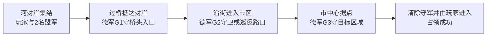

# 巴黎过桥与占领市中心任务设计

2026年10月7日22:25 EDT。状态：用户已确定任务方向，具体地点和运行集成待完成。[英文原文](BRIDGE_TO_CENTRE_MISSION_DESIGN_20261007.md)。

10月8日：[候选坐标与二维标注](MISSION_LAYOUT_20261008_ZH.md)已形成，供评审。这些是草案地点，不是已经验收的正式布局或实走通过的整条任务走廊。

盟军从目标所在区域的河对岸出发，第一个任务是过桥，再沿街道推进并占领市中心据点。这样可以利用现有巴黎地图形成接近、桥上瓶颈、街道遭遇和最终进攻的清楚节奏。下一步地图验证应围绕这条选定走廊及附近战术位置展开，不必等全部白格都被认证后才制作第一条任务。

本方案具体化此前的[任务循环设计](MISSION_LOOP_DESIGN_20261007_ZH.md)：把通用路线改为过河进入市中心，并将初始3名德军分布在推进过程中。原生命周期、枪械事务、死亡账本和整图重开设计继续适用。本文件没有直接选定任何坐标、导航配置或原生资产。1944年8月沿用项目设定，这是一条玩法路线，不是已经考证的真实历史战斗。

## 任务路线与敌军职责

下图表示任务关系，不是已测地图，不包含坐标、真实街名、比例或行程时间。

| 地点 | 玩法作用 | 第一版定义 |
| --- | --- | --- |
| 集结点S | 安全开始，并让玩家看懂推进方向 | 玩家与2名原盟军位于选定目标的河对岸。准备阶段由真实城市遮挡保护，不直接暴露在敌军火线中；给原胶囊和队形留出空间。 |
| 桥梁B | 第一次有意义的通行任务 | 登记且存活的玩家穿过指定桥，进入桥面之外的对岸街道范围。G1位于对岸入口附近，有掩体和可达的搜索／返回点。任务是过桥，击杀G1不是必须条件。 |
| 进城路口R | 提供不同视线条件下的第二次接触 | G2利用既有掩体守卫路口，或沿已验证短路线步行巡逻。玩家到达路口推进目标，可以交火，也可以利用既有街道通过。 |
| 市中心C | 清楚的最终目的地 | G3守卫选定的街道或开放空间据点。清除完整登记的据点守军组后，存活玩家进入占领区，且区内没有存活的已登记德军，判定占领。 |

沿用Assignment 3首版人数：**1名玩家、2名盟军、3名德军**。3名德军从准备阶段就在初始名册中，身份和资源保持独立。任务推进不补刷敌人，不移动、复活或补充其弹药。发现真实可见目标、有限追击／搜索、返回守卫／巡逻继续由原独立AI完成。提前被击杀的守军保持死亡并记录在账本中。完成这6个角色的任务后，再根据节奏和性能决定是否增兵。

把3名敌人分布在路线上足够制作小规模功能首版，不等于已经验证难度或形成大型战斗。用掩体切断过长、无遮挡的火线，确保小队接近时敌人能够实际发现目标。现有枪械逻辑负责遮挡和伤害。此前平地遭遇中两名盟军均未开枪就阵亡，因此布局与初始视线仍需实测，不能直接视为平衡通过。

## 目标判定与重开

1. **通过桥梁。** 记录本轮存活玩家经过近岸和桥区域，再接受对岸目的地实际重叠。经过记录防止从无关入口抵达终点却被判成过桥。盟军负责跟随和支援，其进入触发区不能替玩家完成任务。
2. **抵达市区入口。** 接受存活玩家与选定路口范围的当前重叠。目标激活时也检查已经处于范围内的玩家。G1／G2击杀为可选，伤亡在推进中保留。
3. **清除市中心守军。** 初始为G3的非空守军组必须登记完整，并具有原逻辑产生的有效死亡事件。提前合法击杀计入，重复事件不重复计数；丢失、卸载或移除实体不算死亡。
4. **占领据点。** 据点守军清除后，存活玩家位于占领区，且区内没有任何已登记的存活德军。盟军或尸体进入不能占领。激活时重新检查实际重叠。持续守点计时可在后续增加，首版采用上述明确条件。

先处理本轮伤害／死亡，再推进目标；同帧玩家死亡优先于占领成功。盟军伤亡影响结果统计，不锁死目标。这避免玩法死锁，但导航验收仍需观察两名盟军一起走完选定走廊。用本轮代次与已登记身份拒绝旧回调和重复事件。

玩家死亡后可从头重试。完整重开重新加载配置好的任务世界，核对初始6角色名册、声明的生命／弹药、目标状态、原生绑定、计时器和预约。本轮推进保持生命、弹药和伤亡；沿用此前生命周期／重开设计，不在任务中重置实体来掩盖导航或交战失败。

## 根据现有证据选择地点

**优先把下方C桥作为候选。** [桥梁结果](BRIDGE_CONNECTIVITY_RESULT_20261007_ZH.md)已记录原玩家在两个独立入口中，分别沿原城市碰撞完成两个方向的过桥，路径约45.4米。它没有认证盟军、小队、任意桥面点或A／B桥。起始岸依据最终目标的真实道路入口确定，本方案不预先指定某一岸或罗盘方向。

市中心据点从真实城市道路和易读、可防守的空间中选择。测试汇聚点和世界包围盒中点都不会自动变成正式目标。每个锚点保留XYZ、实际步行支撑和局部高度／层信息；俯视白格不能单独判断叠置高架或桥入口。

S、两个桥入口、R、C、德军守卫／巡逻／搜索／返回点及盟军支援位置，都记录地图身份、世界坐标、原胶囊落地净空、原支撑、完整UE路径、实际到达、视线及路线长度／耗时。排除ML014隔离范围和已测到的到达碰撞重叠。替代地点必须形成新的冻结记录和验收门槛。

[标准UE移动清单](UE_STANDARD_NAV_RESULT_20261007_ZH.md)在69个起点中，每阵营实际到达26点、负面43点。[查询诊断](UE_STANDARD_NAV_QUERY_RESULT_20261007_ZH.md)结合临时扩大覆盖及复制65,536节点过滤器，在3个旧失败点恢复完整路径；这些高预算路线还未实走。现有证据足够开展走廊设计，但其导航集成尚未完成。先针对选定任务确定覆盖范围和实测查询预算，再实际行走并重新加载同一份已保存设置。第一条走廊落地不需要先做全城高预算扫图。

## 已读失败案例与本次改变

| 已读案例 | 本方案吸取的经验 |
| --- | --- |
| [NI002](../../../Failures/NI002-20261007-formal-npc-startup/FAILURE_ANALYSIS.md) | Playing之前限制玩家攻击及NPC战斗／移动；延后暂停会在准备阶段消耗名册。 |
| [NI003](../../../Failures/NI003-20261007-npc-acceptance-fixtures/FAILURE_ANALYSIS.md)与[ML010](../../../Failures/ML010-20261007-formal-squad-passage/FAILURE_ANALYSIS.md) | 完整查询不等于实走成功。必须观察两名原盟军共同通过任务走廊，记录实际跟随目标并保持原到达判据，不宣称两项既有跟队失败已修复。 |
| [ML011](../../../Failures/ML011-20261007-formal-encounter/FAILURE_ANALYSIS.md) | 每个接触点验证视线及双方实际开枪，保留平地负面；启动隔离不等于AI或武器修复。 |
| [ML014](../../../Failures/ML014-20261007-grid-runtime-return/FAILURE_ANALYSIS.md)与[ML015](../../../Failures/ML015-20261007-bridge-surface-identity/FAILURE_ANALYSIS.md) | 保留原碰撞／到达判据与隔离区。桥上检查已认证城市覆盖层，避免仅认可裸桥组件，也不准入未知支撑。 |
| [ML019](../../../Failures/ML019-20261007-convergence-runtime/ANALYSIS.md)与[ML020](../../../Failures/ML020-20261007-saved-nav-coverage/ANALYSIS.md) | 查询拒绝、真实移动失败和地形障碍含义不同。统一选定导航范围与预算，保留旧负面。 |
| [ML021](../../../Failures/ML021-20261007-standard-nav-fixture/ANALYSIS.md) | PIE前保存并恢复原角色碰撞；路线测试前先验落地站立。 |

**本次机制改变：** 围绕明确的过桥进城走廊和3个有限敌军职责选择可用点，不再以全图白格认证作为任务设计前提。第一目标改为记录真实过桥，最终目标改为清除守军加占领；G1／G2击杀可选。保留UE原生导航、认可模型／手指姿态及已验证开枪／换弹／伤害逻辑。

**早期验收：** 永久布局前，先按独立方案建立冻结候选的临时6角色走廊场景。准备阶段资源和落地不变，不发生交战或非预期角色移动。原玩家与两名盟军共同经过近岸入口、真实桥支撑、对岸出口和市中心入口，保持原碰撞／到达判据。至少观察一个拟定接触点的真实发现和双方开枪。机械通行与战斗结果分别记录。高预算实体测试使用新有界身份，不重跑已经停止的默认预算入口。

**停止条件：** 部分路径／查询预算失败、站立／重叠失败、未确认桥支撑、未解决小队到达、非预期启动伤亡、缺少要求的交火观察、旧事件推进、名册丢失、保护字节变化或严格日志错误，都拒绝或暂停这条走廊的准入。保留失败；不同导航／场景／地点机制需要补充方案和新身份。不删除碰撞、不放宽门槛、不补资源，也不反复微移地点刷通过。

## 后续实施顺序

| 阶段 | 可评审产物 | 继续前的门槛 |
| --- | --- | --- |
| 任务走廊 | 冻结S／B／R／C及敌人位置，选定原生覆盖／过滤器，原玩家及2盟军实走 | 先有界实施方案，再过桥／群体早期检查及路线审计；任何保存前保留恢复材料，保存后重新加载验证。 |
| 任务流程 | 准备／开始、过桥记录、有序抵达／清除／占领、HUD及结局 | 六角色资源保持，提前击杀／死亡／重叠判定正确，局部接触已观察；原动作不变。 |
| 可重复游玩 | 重试／完整重开和3次完整流程 | 没有旧动作／目标／预约、重复装备、推进死锁或本轮资源凭空增加。 |
| Assignment交付 | 实时演示、目标性能、压力结果、进度报告及有效build／source／video链接 | 按[Assignment 3清单](../ASSIGNMENT3_ACCEPTANCE.md)验收；走廊设计和独立导航不等于整个MVP通过。 |

本轮仅记录设计。没有启动UE、保存布局、正式采用导航、修改模型／手指／枪械、提交发布或宣称整条任务完成。
