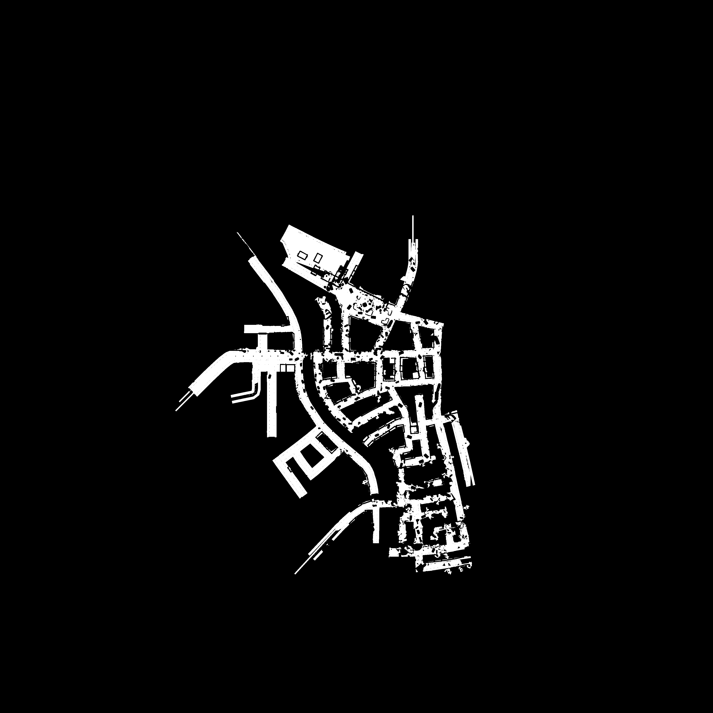

# 巴黎25厘米精细网格结果

## 未标注规划底图

10月10日存储／精度选择：当前规划只用25厘米版，1米版已淘汰。两张文档配图与原审计底图字节一致，均为4032×4032、每像素25厘米；X/Y范围各为−50400至+50400厘米，列沿+X、行沿−Y。L0是局部最低表面排序，不是已确认建筑楼层。白色只表示准入候选格心，黑色包括未准入／未知区域，不等于全部物理不通。两种测绘范围不能混用。

[未标注25厘米保存导航L0通行候选底图](../../Images/MissionLoopV1/PARIS_GRID_25CM_SAVED_L0_20261007.png)

扩展图用于规划，不证明正式导航已覆盖每个白格。私有原图／审计保持不变，图像进入Git不增加实际行走、小队或最终选点验收。以下保留原日期的结果。

2026年10月7日。**已将选点网格由1米改为25厘米，原生重新采样，同一世界范围的网格密度提高16倍。扩展测绘图已把C桥两岸这对测试位置连接到同一组；当前保存导航的细格筛选仍分组。** 现有模型、手指、枪械逻辑、AI、正式地图与导航均未修改，没有选择最终出生、任务或遭遇位置。

与英文结果同步。执行前阅读实施方案和ML006、ML008、ML012–ML017。旧1米数据、工具、移动失败和桥梁负面全部保留，两个新准备失败已进入Failures索引及私有认证归档。

## 实际测量与保护

边界仍为X/Y各−50400至50400厘米，4032×4032，每像素一个25厘米格心。列沿+X、行沿−Y；脚底Z逐点原生测得。白色表示满足当前条件的格心；黑色包括阻挡、缺少连接和未准入，不能全部解释为物理障碍。格内任意位置没有自动准入。

正式尺寸胶囊半径34厘米、半高96.23316厘米、台阶45厘米、坡度44.7651度不变。城市精测包络保留原城市支撑、多边形邻接、旧格心漏采多边形和三桥邻域；外围非城市或未知表面仍黑色，未把全部外围Landscape逐格复测。

| 范围 | 新格心记录 | 几何净空通过 | 有向连接记录 | 连接通过 |
|---|---:|---:|---:|---:|
| 当前保存导航 | 1,345,702 | 1,326,254 | 2,809,784 | 2,777,028 |
| 临时扩展测绘 | 2,215,761 | 2,148,657 | 5,104,876 | 5,060,095 |

独立审计重新计算判据、坐标和来源，误准入0，最大指定表面XY误差7.1054×10⁻¹⁵厘米。环境、碰撞、车辆快照和703项保护精确；3个旧测绘辅助二进制保持原字节。自有UE21992、32260、2004、30708均正常退出0／严格日志0。没有保存世界或正式导航，没有移动正式角色、开枪、修改资源账本、发布、提交或推送。本次不是FPS、动作接触、小队或MVP验收。

## C桥与精度的实际区别

旧1米图中C桥支撑没有道路连接准入。25厘米图中，当前保存导航有239个裸桥支撑净空节点，其中230个到道路连通；扩展测绘有670个，其中661个到道路连通。细化确实补出了连接，但不等于消除所有导航／筛选差异。

两岸测试位置仍是[1950，−20650]和[5850，−20250]厘米，不是最终选点。保存导航附近细格仍为组10和3；扩展测绘附近细格同为组3。对扩展原生双向连接另做路线重建：约56.778959米，69个节点位于原C桥包围盒内，脚底Z108.627199..153.312479厘米，符合已确认桥区域的高度范围。它是四向细格路线，不是新角色实走；此前原玩家两向约45米的实际移动证据继续独立保留。

仅确认这对局部桥两岸测试位置，没有把所有道路组或整片两岸自动合并。A桥有净空节点但没有桥支撑道路准入；B桥有部分道路连接节点，但未确认实际跨岸通行。A/B、盟军、德军及小队仍未因精图取得通行或战斗验收。下一次针对保存导航断点应检查具体连接原因，不能继续缩格、放宽碰撞或涂白求通过。

## 新选点工具

私有选择入口：`Evidence/FineMapGridV1/expanded_v2_20261007/artifact/PARIS_FINE_GRID_TOOL_20261007.html`。默认显示临时扩展城市测绘、全部道路连通组；可切换当前保存导航、特定连通组、实际叠置表面和用途。全部组的白格不保证彼此可达，选点仍须同组核对。叠置序号不是建筑楼层。

- 生成候选：2／3米内的保守1米站位网格，独立站位至少相隔1米；中间25厘米连接均检查。任务候选四向1米操作站位同样检查全部中间连接。
- 原1米失败区域完整映射为16个细格，两个范围各排除15个实际城市节点，连通组重新计算，所有用途都保持黑色。
- 细格遭遇端点的精确双向视线尚未测量，此筛选暂全黑；旧1米视线记录仍在旧工具，不能移到不同的新端点。
- 勾选“已实测C桥玩家路线”可显示此前真实轨迹，并切到当前导航最低表面核对。绿线与黑白准入独立，不把黑格涂白，也不准入其他角色或用途。
- 点选保留厘米XYZ、实际支撑／表面、原生来源、连通组与草案状态。导出实体中心是声明最大胶囊的参考值；以后放置具体角色应采用其实际半高并重新验证。

生成72张纯1位用途PNG及8张组编号图，均4032×4032；掩码／完整失败范围审计通过，4项真实米数与中间断链检查通过。工具151,510,413字节，366个数据块，点击仅解压附近块，最多缓存4块／2个视图；53项坐标、范围、Z、隔离与数据读取检查通过。文件较大，浏览器／iPad手动操作与性能未验收，不能声称触控已验证。对比图已实际目检，来源与各输出SHA-256在私有回执中保留。

## 准备失败与选用来源

ML016：early_v1在原生采样前因UE Python缺少NumPy停止。不同early_v2将对照计算移到已有离线环境，原生道路／障碍／叠层／三桥检查通过，738项坐标对照；未改判据或安装引擎依赖。

ML017：city_v1完成保存范围后，扩展准备因重建编号变化失败；27836个多边形真实顶点全部对应，但25832个编号不同。其整体失败原样保留，已完成保存范围独立审计通过。不同expanded_v2用不取整的世界顶点精确选择包络，再以新编号原生测量；明确复用已完成的保存数据，没有重复成功查询、复制跨范围高度／连接或重跑失败身份。

选用来源为expanded_v2及其明确引用的city_v1保存范围。正式资源仍为原703保护纪元，地图哈希9ff18c13…d65b不变；所有自有引擎关闭，原生槽位释放。完整原始记录、独立审计、路线、掩码、工具、图示与失败认证归档均保留在私有忽略区。
