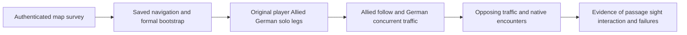

# Formal character and squad map verification

7 October 2026. Prepared before implementation and execution. The user authorizes
verification of the selected player, Allied and German characters on the surveyed
map, concurrent squad traffic, and actual encounters between the factions.
Every coordinate in this work is a disposable test stimulus. **No final spawn,
mission objective, encounter site, patrol route or playable boundary is selected.**
[Chinese review](FORMAL_ROLE_SQUAD_TEST_PLAN_20261007_ZH.md) is synchronized.

## Baseline and protection

Use the saved 9ff formal map and current 703-row ledger, including the authorized
three local recoil DLLs. Read AGENTS, HANDOFF, Failures/README, the pure-map final
result and audit, NI002, NI003 and ML001–ML007 before execution. Preserve the
original models, rigs, weights, fingers, selected native grips, weapons, actions,
combat transactions, controllers, trees, map, navigation settings and Catalog.
No source asset save, Blueprint authoring, formal map edit, commit or publication.

The pure-map survey rebuilt navigation in unsaved memory over a larger domain.
This attempt first uses the **actual saved formal navigation**, without rebuilding
or extending it. A survey pass outside that coverage is not automatically a
formal-game pass. Record the missing coverage as a separate negative, rather
than silently expanding navigation. Retain XYZ and surface identity.

Current follow/reservation logic explicitly accepts TeamId0 and has two slots.
German bodies use guard/search/combat policy. Test their three-body concurrent
traffic and native hostile interaction; do not call it an implemented German
leader-follow formation or add that capability during verification.

## Failures read and changed mechanism

| Cases | Lesson | This attempt |
| --- | --- | --- |
| ML001 | Occupied actor goals can stop short; Idle is not a completion reason. | Use unoccupied surveyed surface goals; observe native request IDs and results. Do not rerun the stopped occupied-roster loop. |
| NI002 | Native combat starts during bootstrap and can consume the roster. | Hide the finite original roster before PIE, admit native bootstrap and unchanged resources, then enable each declared stage. Encounters use fresh PIE/worlds; no resurrection or ammo refill. |
| NI003 | Projected formation offsets can select another surface; orientation, hidden collision and 57cm body-arrival failures matter. | Record raw/projected goals, actual controller heading, real floor and body errors. Nonparticipants park only on authenticated survey surfaces. Hidden collision stays enabled. Preserve unchanged 55cm formation-body criterion. |
| ML002–ML005 | API assumptions, loading reentry, cleanup and leaked gameplay invalidate evidence. | Use installed native APIs, a busy/finally loading guard, unique entries, actual world instances and explicit owned shutdown. |
| ML006 | Vertex average is not necessarily the detailed floor. | Reuse exact-surface v2 and authenticated standing observations; never add offset searches or enlarged Z tolerances. |
| ML007 | A simulated parked car can change the obstacle field. | Retain the admitted static fixture in unsaved tests only, with exact transforms/bounds/collision and continuous zero drift. Do not remove obstacles. |

The old MapSurvey helper deliberately rejects subclasses for floor/request-state
observation. Preserve that helper and all its hashes. A separate disabled,
Editor-only ParisFormalSurveyV1 plugin supplies formal-character CurrentFloor
and passive PathFollowing completion observation. This is a demonstrated
diagnostic gap, not a new gameplay AI. Its temporary native path request for the
original PlayerController uses the same PathFollowing/CharacterMovement system;
it preserves possession and the approved FP owner. Automated player travel is
not human-input or first-person visual acceptance.

## Frozen test selection

Pre-entry ML008 correction: bankV1's package-only criterion selected Landscape
supports. No UE or movement ran. Preserve V1 and its original plan/source hashes.
V2 excludes Landscape on observed route supports and requires an actual Road
component among samples. Keep all native/resource/collision/arrival gates.
V2 then rejects a candidate with only four of five required standing sites before
any UE entry. V3 admits a route only when its declared start/end/leader capacities
are present in the offline evidence, preserving all rejected candidate reasons
and unchanged500cm/30cm/100cm site limits. No physical retry or broadened bounds.

Before UE entry, write a private authenticated case bank from the completed
pure-map evidence. Select deterministic reciprocal passed pairs supported by
Paris environment components, excluding Engine BasicShapes and outer proxy
geometry. Keep within the recorded saved navigation bounds with a margin.
Choose a flat street pair, a narrow or turning pair, and a height-changing pair.
Prefer paths 4–20m long; record the exact selection rule and source case hashes.
Select distinct additional standing sites from already passed observations for
two Allied and three German bodies. No unchecked far parking, random offset
scan, reuse of a rejected formation endpoint or post-failure replacement site.

The bank defines 36 individual directed legs: six original formal bodies ×
three route categories × two directions. The early gate separately exercises
one player, one Ally and one German on the flat route in both directions.
Its six controls do not enlarge the main denominator.

Concurrent stages define six two-Ally follow episodes, six three-German traffic
episodes, and two opposing traffic episodes on the flat/turning routes.
The Allied stage uses its actual native follow/reservation policy and once-set
player heading/temporary leader destination. The German traffic stage starts
native paths simultaneously on three unchanged bodies with decision policy
isolated; it does not invent a three-slot squad coordinator.

Three separate fresh finite encounter entries use the flat, turning and height
categories. Flat/turning use two Allies versus three Germans; height uses one
per faction if the frozen standing sites cannot accommodate all five distinctly.
This smaller case is labeled explicitly. Existing native sensing, target choice,
chase/guard/search and combat stay authoritative. No Python sight callback,
Blackboard write, target assignment, shot request or per-frame movement driver.

## Admission and evidence

Early bootstrap requires all five selected formal brains/private Blackboards,
two Allied/three German grip bindings, original player FP initialization,
100HP/2 loaded/16 reserve/zero shots, unchanged capsule/movement profiles and
single coordinator/FF policy. Hide before startup; disabling after depletion
does not admit a fixture.

After one declared initial placement, allow normal settlement. Require no
observed blocking overlap, walking mode, walkable CurrentFloor, XY and capsule
feet within35cm of the authenticated surface. Query from actual feet with the
actual world navigation and agent; require valid complete nonpartial path.
Native individual/traffic requests use30cm acceptance, exclude capsule reach
padding, and require matching request/controller/SUCCESS, Idle, XY≤35cm,
feet≤35cm and walking floor. Preserve original speed/step/slope/gravity/RVO.
Deadline max(12s, path length/current maximum speed×2+10s).

Allied formation arrivals additionally require unique retained native slots,
valid reservations and each real body within the existing55cm of its actual
HeldGoal. Record raw/projected goal and floor identity; a projected point or
native Arrived flag alone is insufficient. Record pair separation, movement
stalls, replans and final position per member. Do not disable collision/RVO or
increase tolerances to pass congestion.

Encounter window is30 game-seconds after admission. Record initially obstructed
and later actual LOS, sensed hostile object/HasVisibleTarget, real approach
trajectories, native decision/action phase, shots/outcomes, health and conserved
ammo, casualties and dead-body stopping. A functional encounter requires both
factions to acquire a real opponent and fire through original transactions,
with hostile damage observed. Firing only at the passive player does not count
as Allied-versus-German interaction. A failure to meet remains a negative.
No kill/reset/teleport of an engaged actor and no hiding engaged casualties.

Use normal time/rendering in these bounded entries; record cadence without
promoting it to an FPS benchmark. Save representative unpaused original images
for movement and encounters and inspect them. This does not clear the stopped
full-motion/contact or near-wall gates.

## Stop conditions and storage

API/ensure/log errors, changed protected bytes, invalid binding/resources,
reentrant loading, vehicle drift, missing original identities or lost player
possession globally stop that entry. Preserve original failed receipts. A physical
case rejection stops that case and remains negative; only other previously
frozen independent cases may continue. No offset/angle/time/tolerance sweep or
native repair follows from a failure. A different mechanism needs a new bounded
document and early gate. An early diagnostic failure blocks broad admission.

Check actual process ownership before build/entry; preserve foreign/user editors.
Restore process-local editor settings and end owned PIE normally. Launcher budget
15min per entry; hard timeout is owned-only and is recorded as failure.

New source resides in Tools/Integration/FormalMapVerificationV1 and the separate
Editor-only plugin. Raw case bank, JSON, logs, builds, images and commercial-derived
visuals stay private in Evidence/FormalMapVerificationV1 and tmp/formal-map-v1.
Independent audit checks denominator, completions, real arrivals, resources,
bindings, normal exit/logs and current703. Final bilingual results explicitly
distinguish saved-nav coverage, solo travel, formations, German traffic, hostile
meeting, visibility and damage. No test coordinate is promoted to mission design.

## Observation addendum after early admission,7 October

Read ML009:6/6 native controls and independent audit pass, but all six original
global-viewport images fail visual review. Preserve them; no physical rerun.
For the already frozen main cases use an unsaved whole-scene SceneCapture2D
fixed before travel, export its own native render target, inspect the originals
and record camera pose/time/actual subjects. No show-only list, lighting change
or gameplay camera/FPS acceptance. An unreadable image remains a limitation.
This changes observation only; native helper, cases and physical gates remain.

Before the unrun encounter entries tighten the passive observer: faction shot
evidence requires a new ShotSequence delta at that sample, a real opposite NPC
TargetActor and native LOS; hostile damage evidence additionally requires the
original `Hostile hit` outcome and a health decrement in that interval. Record
uncertain causality rather than counting old player-directed shots. Observe
casualty generation, reservations, stopped motion/shots after0.75s; never reset.
Record raw leader-frame slot targets alongside actual native HeldGoal and body.
Any API/global invariant failure stops the entry; physical negatives retain
the original frozen tolerance and are not compensated.
