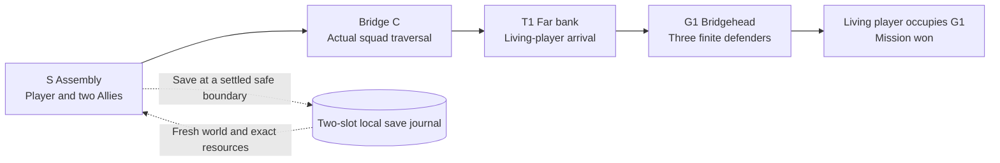

# G1 bridgehead midterm implementation

8 October 2026. Authorized by the user's instruction to write the document first, then develop. Chinese review: [中文](G1_MIDTERM_IMPLEMENTATION_20261008_ZH.md). Status at authoring: implementation and native acceptance pending.

Execution is now recorded in `G1_MIDTERM_RESULT_20261008.md` with synchronized
Chinese review; its verified later records supersede the planning snapshot.

## Playable scope

The midterm ends at G1: **assemble → cross bridge C → defeat the three registered bridgehead defenders → occupy the bridgehead → result**. Keep one player, two Allies and three Germans. Junction and city-centre objectives move to the final roadmap. This supersedes their inclusion in the midterm, not the longer route design or course delivery requirements.

No new soldiers, weapon fitting or finger changes. Preserve selected FP, Allied and German presentation, original movement profiles, fire/reload/damage transactions and friendly-fire OFF. Objective changes never heal, refill, revive or spawn replacements. Ally deaths affect the result but do not block success. Player death takes precedence over completion in the same update. Missing required actors are a technical error, never a kill.

## Evidence and changed mechanism

Read AGENTS.md, HANDOFF.md, Failures/README.md, the Assignment 3 goal/acceptance, proposal, technical design, pipeline, mission lifecycle design, bridge-to-centre design and reviewed 25 cm candidate layout. Relevant cases read:

| Case | Requirement in this implementation |
| --- | --- |
| NI001 original action adapter | Reuse original transactions; lifecycle reset preserves ammo and is insufficient for a full restore. |
| NI002 startup fighting | New mission-only controller children initialize a private Blackboard without starting a tree. Bootstrap equipment with no admitted behavior; release the retained tree only on Start. Gate player input before play. |
| NI003 projection and observer mistakes | Record actual body arrival and player control rotation; no CDO navigation calls or inferred physical passes. |
| ML010 squad arrival negatives | Test both Allies together across C; preserve failed receipts and original thresholds. No offset/time sweep to force a pass. |
| ML011 encounter negatives | Bootstrap without follow/combat, admit standing first, then measure real opposing shots and damage. Seeing a target alone is insufficient. |
| ML020 saved navigation coverage | New mission map owns the selected corridor's saved navigation; complete queries and fresh-load physical travel are separate gates. No custom A*. |
| ML021 collision leak | Preserve all original actor collision flags during authoring and restore them before PIE. |

**Changed mechanism:** add an isolated runtime mission controller/GameMode, mission-only derived NPC controller, safe snapshot journal and HUD/input entry. Keep the original formal map and existing action/presentation assets as dependencies. Bootstrap before behavior admission replaces delayed pauses. A full new world replaces in-place resurrection as the load/retry boundary.

**Early acceptance:** all six original characters stand with their selected equipment for ten game seconds in Ready, with zero shots, damage, ammo changes, deaths or AI moves from world creation. Start enables the original behavior once. A pure compilation or delayed freeze does not pass this gate.

**Stop:** any premature action, duplicate/missing roster, failed standing or selected physical route, corrupt/partial restore, created ammo, stale action acceptance, protected-byte drift or Error/Fatal/ensure stops that entry. Preserve its identity/log/source/result. A different documented mechanism is required before another bounded attempt; do not change model, fingers, collision, original weapon rules or thresholds to rescue it.

## Map and ownership

Create `/Game/ParisCombat/Maps/LV_ParisG1_Midterm_V1` from the current formal map, with new mission packages under `/Game/ParisCombat/Mission/G1V1` and source plugin `ParisBridgeMissionV1`. Do not overwrite `LV_ParisStreetCombat_V1`, the Catalog or any of the current 703 protected rows. Snapshot and verify those rows before and after each native writer; inventory new owned files separately. Retain failed new assets as evidence rather than deleting dependencies. Do not touch unrelated NPC/MuzzleFlash work or publish/commit/push this increment automatically.

Use the reviewed S/A1/A2, C bank endpoints, T1 and G1 XYZ as planning anchors. Their L0 labels are local stacks, not floors. G1's existing guard and two additional nearby white-cell candidates form one sealed group of three. Freeze and record the additional positions in the authoring receipt before runtime. Validate their original capsule standing, navigation, sight/fire lanes and actual encounter. The previous G2/G3 city positions remain roadmap data and are not required kills in this mission.

| Anchor | Feet XYZ in centimetres |
| --- | --- |
| S player (adopted near-bank V2) | 1912.5, -20662.5, 113.762134 |
| Ally 1 (V2) | 1762.5, -21112.5, 110.377514 |
| Ally 2 (V2) | 1487.5, -20837.5, 96.834814 |
| C near bank | 1950, -20650, 114.262990 |
| C far bank | 5850, -20250, 110.149995 |
| T1 | 5837.5, -20237.5, 110.150006 |
| G1 | 7087.5, -20287.5, 132.783997 |

Updated after the separately documented and visually admitted near-bank V2 plan.
The original S[-3162.5,-25937.5,110.116898] is rejected for spawn use by ML022;
retain it only as a measured approach reference or explicitly isolated unit fixture.
See `G1_NEARBANK_STAGING_PLAN_20261008.md` and the latest result for admission.

Native UE navigation covers the selected approach/bridge/bridgehead, using the original agent. Save, reopen and query its actual coverage. Larger query budgets are adopted only if measured necessary; the old unsaved 65536 experiment is not automatically a production setting. Player and both Allies must physically traverse the mission corridor without teleport, health/ammo reset or frame-driven positioning. Test the German group locally. Keep support meshes and vendor collisions intact.

## State and save contract

States: Preparing, Ready, Crossing, Clearing, Occupying, Won, Lost, Error. Seal six stable mission IDs using actor tags, never editor labels in ordinary runtime. New runtime begins with a fresh generation. Ready admits no player movement/fire/reload or NPC behavior. Enter starts; F5 saves; F9 loads; Ctrl+R restarts from the original mission configuration. Plain R retains original reload. HUD shows one current objective, remaining defenders, authoritative resources, save feedback and explicit controls.

Crossing requires the living player at T1. Record legitimate G1 deaths from the start; Clearing requires all three registered defenders dead. Occupying requires the living player in the G1 volume after clearance. Reconcile after original damage/death updates, checking player death first. Terminal outcomes lock new combat/movement and retain the result. An ally casualty never creates a replacement.

F5 captures only a settled safe boundary: valid roster, all living bodies grounded, no fire/reload transaction in progress, no current hostile line of sight or admitted hostile action. Unsafe requests explain the reason and change no state. A Won result can be saved. Lost/Error cannot overwrite a good save. Saving records schema, mission/config fingerprint, serial, phase/objective/death ledger, each stable ID/class, transform, health, loaded/reserve ammo, shot sequence and player control rotation. It must not modify gameplay resources.

Use two alternating local SaveGame slots with a payload checksum and monotonically increasing serial. Write the inactive slot, reload/validate it, then report success. Never replace both slots in one operation. Validate schema/config, checksum, all six unique identities/classes, ranges and coherent phase/death state before applying anything. Choose the newest valid compatible slot; report rejected corruption/incompatibility. If neither is valid, remain in the current run without partial mutation. This journal preserves the previous valid snapshot; it is not a claim of filesystem atomicity or cloud sync.

Load validates first, then reloads the new mission map with an explicit load request. On the new world's gated bootstrap, invalidate action generations via existing lifecycle endpoints, restore exact snapshot transforms/resources/control rotation and reapply recorded deaths through original death handling. Do not resume a half reload, old perception/target/reservation or stale timer. Start the retained brains only after all restored actors and mission state verify. Restored dead actors stay dead. A fresh process using the same load entry must reproduce the snapshot; a same-process memory variable is insufficient.

Full restart always reloads the initial mission map, ignores the saved snapshot and uses a new generation. It must restore the declared six-member initial roster once, with no duplicated rifle, adapter, controller or policy. Normal objective progression never performs this reset.

## Development and acceptance order

1. Author the isolated runtime/controller/map and save recovery/owned inventory. Compile without changing protected dependencies.
2. Pass the ten-second Ready/Start gate and check original player controls, bindings, resources and separate Blackboards.
3. Save/reopen corridor navigation; run actual player and simultaneous two-Allies route and bridgehead standing/encounter tests. Record physical negatives separately from query failures.
4. Exercise objective ordering, early kills, ally casualty, player death, full retry/restart and missing-actor error. Tests may deliberately invoke original damage endpoints; label them separately from natural combat.
5. Save a non-default finite state and close the process. A fresh process loads exact positions, health, ammo, casualties and objective. Test no-save, unsafe-save, checksum/schema rejection and both journal slots without overwriting the valid control.
6. Run ordinary saved `-game -DisablePython` with the authoring bridge disabled. Inspect real visuals and logs. Record native test evidence and remaining gaps in synchronized results.

Functional G1/save acceptance does not establish the Assignment 3 1080p/60 FPS, stress/demo video, progress PDF, playable packaging/second-machine access or course prerequisite approval. Those remain explicit delivery gates; the shorter mission does not remove any of the four pillars.

## Authoring correction after the first entry

Read MI001 before Author V2. AssetTools world duplication followed by LoadLevel failed the editor's world-GC check before a G1 map file or gameplay existed; all703 original rows are independently exact. Use the installed active-world SaveMap save-as API instead, and require the new current package path before edits. Reuse the new controller only against the failed entry's authenticated closure hash. The early gate and stopping conditions above are unchanged; no original asset rollback or route retry is involved.

Author V2's SaveMap writes a new disk copy but leaves the original world current; the mandatory path check stops it before any roster/nav edit. V3 loads only that exact authenticated new disk copy in a fresh process. No duplicate world is retained and neither stopped creation method is repeated. The original703/path/early gates remain unchanged.

V3 writes the intended map/nav but a reentrant save callback makes its overall receipt fail. Do not repeat the save. A new read-only process must authenticate the recorded map/controller hashes, all six exact placements/tags/collision/controller classes, GameMode and310tile/1656polygon saved nav before entering the unchanged Ready gate. MI001 retains the failed raw receipt. The author now guards callback reentry for future distinct work.

Ready V1 supplies fresh map and ten-second passive resources/standing samples but blocks in its capture API. Its declared rotations also fail independent review because positional Python Rotator arguments selected the wrong axes. The distinct headings_v1 changes only the owned map's world rotations to explicit upright yaw35/180, with recovery and all other actor data/703 exact. Ready V2 must check real headings and use guarded deferred viewport capture with verified files. No model/finger/position/threshold changes; preserve V1 as interrupted invalid fixture.

The independent thirty-second encounter fixture starts Player/Allies in T1's measured white group within300cm, keeps the three frozen G1 defenders and original resources, and admits only after the same Ready standing gate. V1's player400cm-west proposal is statically rejected at275cm from white, before UE; retain that record. V2 freezes the measured western centre5712.5,-20237.5 plus the two originally proposed nearby white Ally centres, all at least150cm apart. No main-map spawn changes or runtime coordinate retries. Require both factions' actual shots and hostile damage; this fixture is not a player/squad approach pass or natural player victory.

Read MI001 before Functional V2: the first observer's raw unreal.Name field prevents JSON serialization after its original damage/fire fixture. Normalize only that report field to text, retain its slot/evidence, and use a new G1Functional2 namespace in a fresh run. The identical original shot, casualties, finite ammo, safe save, cross-process restore and corrupt/schema/identity/ammo rejection gates remain. No native action or asset correction follows from a report type error.

Functional V2 persists the non-default serial2 control but fails before bad-slot mutation because its native SaveGame-only fields lack the test interface's visibility. Keep that failed receipt and both valid slots. V9 exposes the existing owned payload/checksum fields and adds read-only journal inspection without changing format/validation/gameplay. A fresh process loads the exact V2 control, then tests fallback and bad slots in an isolated namespace. The controls, original703 and all acceptance criteria remain protected.

Read MI001 before Travel V2. V1 never reaches movement: a clear camera diagnostic ray returns None and the report assumes a HitResult. V2 records that miss explicitly and inventories existing lights without mutation. Same frozen corridor, original native movement/AI and55cm/25second gates; no road/character/coordinate adjustment or threshold relaxation.

Read-only visual diagnosis uses one new Ready entry with four ordinary control
yaws0/90/180/270, unchanged camera-relative transform and no Start. Capture
each after one game second, inventory render bounds/rays/lighting, and require
100HP/zero shots/unchanged703. This separates an obstructed initial direction
from a whole-site problem; it does not authorize hiding scenery or moving spawns.
Stop on resource/guard drift or a missing capture and retain the diagnostic.

## Non-default save fixture V4 after the near-bank visual correction

Read MI001 and ML022. Functional V3's near-bank start correctly refuses an active
Crossing save for hostile line of sight, retaining serial1; the30-second fixture
fails. Do not loosen save safety or change the adopted mission start. V4 isolates
the save unit fixture: stop the five original AI/sensing/movement endpoints,
place only the allied group once at the already measured original approach
coordinates, then invoke the same original damage/fire endpoints and safe-save
contract. This old site remains rejected as a production spawn because of its
rendered enclosure. Require fresh Ready, one admitted original shot, exactly the
declared two casualties, serial2 within30seconds and a new-process exact restore.
Stop on any failed condition; no offset retries or safety exemptions. Use new
G1Functional4 slots and retain V3's serial1/raw failure. This is save-unit evidence,
not route or encounter proof. Lifecycle fixtures additionally remove one living
required actor (must Error, not counted kill), restart, reject saving during the
original reload, and load Ready into a new generation; wait four seconds to
exclude a late old reload commit. All original resource/roster gates still apply.

## Read-only ordinary-game audit correction

Read MI001. PlainV1 normally exits0, native Ready passes,703/runtime inputs are
exact and the editor bridge is absent, but its first audit searches for the
nonexistent wording "Python is disabled". Installed UE5.8's PythonScriptPlugin.cpp
explicitly logs "Python disabled via command-line flag '-DisablePython'" and
returns false at that branch; this exact message is in the raw game log. Preserve
the failed audit and immutable native log/exit/manifest. A separate named audit
revision checks that installed-source-supported explicit disabled message, no
interpreter usage and every unchanged original gate. Require identical raw-log
hash and authenticate the local engine source. Stop on any other mismatch.
This is a new read-only audit mechanism, not a native rerun or relaxed Python gate.
