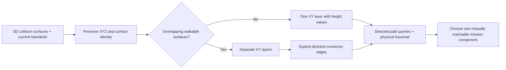

# Current Paris map connectivity and height survey

7 October 2026. User priority: establish mutually reachable spawn, objective candidates and enemy positions before fixing mission locations. This work precedes the S/A/B/C route in [mission design](MISSION_LOOP_DESIGN_20261007.md). [Chinese review](MAP_CONNECTIVITY_IMPLEMENTATION_20261007_ZH.md) is synchronized.

## Scope and evidence boundary

Read-only analysis and bounded editor/runtime survey of the current team map. Preserve map, models, grips, source actions, gunplay, AI packages, vendor collision, NavMesh bounds/configuration and Catalog. No save, rebuild, new NavLink, teleport-to-pass, asset publication or commit/push. Check current Git/external asset state and latest B checkpoint before engine entry. Never start alongside another engine or stop an engine owned by another task/user.

Adopt the authorized current `9ff18c1339ee1de61add8a15acebd56512617ed69547de668b7d59ee1772d65b` map and 703-row ledger; verify exact current bytes, not an older Catalog map. This is a dated snapshot: later verified epochs supersede it.

Read [failure index](../../../Failures/README.md), [NI001](../../../Failures/NI001-20261006-npc-combat-adapter/FAILURE_ANALYSIS.md), [NI002](../../../Failures/NI002-20261007-formal-npc-startup/FAILURE_ANALYSIS.md), [NI003](../../../Failures/NI003-20261007-npc-acceptance-fixtures/FAILURE_ANALYSIS.md), [navigation foundation](../PARIS_NAVIGATION_FOUNDATION_RESULT_20261002.md), existing survey/navigation sources and retained receipts. NI003 prohibits treating a projected or queried point as physically traversed, an Actor turn as control rotation, or a handled ensure as success. NI002 establishes active startup combat; geometry queries use the editor world without PIE so no roster is spent. NI001 establishes that reset does not refill ammunition.

**Changed mechanism:** test both directions between anchors, retain XYZ and vertical uncertainty, separate geometry/NavMesh/actual movement results, and expose unscanned heights. Do not infer connectivity from an overhead image or star paths from the player alone.

**Early check:** exact guards; six unique saved actors; one live editor-world navigation instance obtained through ObjectIterator; actual supported agent configuration; unambiguous feet projection for each actor; all 30 directed roster-pair queries with partial paths rejected. Identity/self paths are handled separately because Unreal reports a one-point path invalid.

**Stop:** any guard mismatch, competing engine, ambiguous world/navigation receiver, Error/Fatal/ensure, projection onto the wrong surface, required partial/missing path or physical traversal failure. Preserve failed evidence; mark the point/edge unresolved or unusable and stop adoption, without changing collision/bounds, retrying arbitrary offsets or weakening checks. Query failure is valid negative survey evidence, not automatically a script failure. Script/API/log failures invalidate the query run.

## Why existing evidence does not settle height or mutual reachability

Historical `NavigationFoundation/fresh_v4` used the older `4c77844f...72c620` map. Its six starts projected and five player-to-NPC routes were complete; reverse and all pairwise routes were not tested. There were 391 complete sampled destinations, 1,157 partial destinations, 51 unprojected candidates and one player-to-self identity point. Those counts are historical observations, not current mission acceptance.

The ray began about world Z=504 cm and retained low street-height hits. The saved NavMesh diagnostic volume spans world Z=-300 to 700 cm, with XY dimensions 420 × 420 m. It neither surveys high building floors nor establishes an absence of usable vertical routes. In the historical receipt, complete path nodes span world Z=60 to 400.756 cm; terrain/bridge/debris elevation cannot be relabeled as building floors. Actor bounds, names containing “bridge/roof,” and visible buildings likewise do not establish usable stairs or interiors.

## Representation decision

Use **a 2.5D survey view: XY + retained surface height + surface/layer identity + confirmed connections**. Unreal's retained 3D NavMesh/MoveTo remains the route authority. This is an inspection/export format, not a new custom A* dependency.

If the selected area has one walkable surface over each XY, display one XY layer with height coloring. If reachable surfaces overlap in XY, display separate layers linked only by inspected/traversed stairs, ramps or other permitted connectors. Continuous street slopes are not new floors. Do not assign layers solely by rounding Z into fixed floor-height bins. A roof with collision but no connection stays excluded/unknown, not a reachable floor.

## Survey sequence

| Step | Output | Acceptance/limitation |
| --- | --- | --- |
| C0: retained-data analysis | Source hashes, XY query-status plot, endpoint/path-node height ranges and limitations. | No engine work and no current route claim. Mark historical map and coarse sample spacing on the plot. |
| C1: current saved-map queries | Current map/agent/bounds; six actor feet/body coordinates; 30 directed roster paths; multi-height projected sample nodes with outward/return status, paths and heights. | No PIE or saved modification. Use actual live navigation receiver; reject partials. Sparse sampled coverage is not a complete polygon extraction or proof that every floor was found. |
| C2: vertical structure inspection | Overhead/side views; candidate stairs/ramps/bridges/openings; collision-supported standing surfaces and head clearance; same-XY stacked surfaces and connector direction. | Search beyond the existing low-height filter. Higher structures outside retained navigation bounds are explicitly outside current NPC navigation coverage, not proven nonexistent. Narrow entrances/steps need finer local probes. |
| C3: physical route verification | Original capsules traversing both directions on connector/anchor edges; actual location, arrival, slope/step, ceiling and blockage records; two Allies together at bottlenecks. | A queried route alone cannot pass this step. In a separate unsaved bounded fixture, suppress automatic combat before it starts and retain source assets/resources. No per-frame pose driver, collision repair, mid-run casualty restoration or teleport arrival. Human player-input playtest remains distinct. |
| C4: anchor admission | Spawn, Reach-volume entrances, enemy home/patrol/search/support points in one verified mutually reachable component. | Objectives stay unset until C1–C3 pass for selected edges. Reject inaccessible upper-floor enemies or reachable-looking isolated islands. |

C1 scans the existing navigation window at coarse XY spacing and several Z seeds with a small documented projection extent. Deduplicate only matching XYZ surfaces, not identical XY. Include higher candidate geometry in C2 even when it is outside NavMesh coverage. Adaptive/finer inspection follows actual candidate connectors and gaps; no universal floor or whole-city conclusion from a coarse grid.

## Connectivity contract and admission matrix

For spawn S, objective entrances A/B/C and enemy anchors E1/E2/E3, record a **directed** matrix. Each cell stores agent profile, endpoint surface IDs, path validity/partial flag, route length and status: untested / query-only / physically verified / failed. Require paths both ways. One-way drops or links cannot be silently treated as reciprocal access. The usable mission set is one strongly connected component under the supported actor profile; player-only access does not admit an NPC objective.

Once a finite connected graph has physically verified both directions on its retained connecting edges, graph reachability can establish transitive access; preserve those edge receipts. Still query all selected anchor pairs and play the actual mission route, including simultaneous squad blockage. Enemy combat reach, sightline and hit obstruction are separate from navigation connectivity. A Clear objective's marker is not itself an extra physical actor; test the encounter space and associated enemy/support/search anchors.

No mission position is selected by this plan. Current six saved actors are the first query set; new mission anchors are selected from the surveyed component afterward. Existing rejected west-side formation goals remain failure evidence, not default mission anchors.

## Artifacts and completion

### Bounded C2/C3 fixture

After a clean C1 receipt, inspect the same-XY stacked samples touching the player's component and the highest mutually queried sample. Record simple/complex downward surface hits, actor/mesh/profile and unsaved side/overhead captures. These are geometry diagnostics, not a universal clearance proof.

For locomotion only, hide the six saved actors in an unsaved staging world before PIE, as the existing B fixture does to prevent startup sight/combat. Let all five original selected-equipment bootstraps finish; require original 100 health, 2/16 ammo and zero shots. Disable their combat through the existing adapter and stop their native brains before revealing the actors. Then use native AIController MoveTo, preserving all source meshes/grips/actions and capsules. The observer samples positions; it never drives poses or moves actors per frame.

One original Ally and one original German each traverse the saved anchor cycle and its reverse, walking back to their own origin. Occupied actor anchors require an 80cm approach tolerance, not overlapping two bodies. This is physical anchor approach evidence, not standing at another actor's exact center. Try the highest C1 mutual sample with the Ally and walk back; use a stricter 30cm unoccupied-goal tolerance. Every leg rejects partial paths, has a length-based finite deadline, and must return Idle with actual XY/foot-height agreement and unchanged health/ammo/shots. Do not teleport/reset/refill. Record failure immediately; no automatic alternate point or fit. The upper/lower surface relationship remains an inspection claim until actual geometry and movement agree.

End PIE, restore staged visibility and background throttling, close only the task-owned process, and verify all703 guards. This isolates navigation; it does not establish original BT/full motion/contact/FP-input/FPS acceptance. Simultaneous Allies on the later selected mission bottleneck and unsampled higher structures remain separate checks.

Source tools and Markdown/SVG stay in Git-eligible source paths. JSON receipts, screenshots, raster plots and raw logs stay in a unique ignored private `Evidence/MissionConnectivityV1/<identity>/`; record sizes/hashes and preserve earlier runs. Snapshot the script before an engine launch. Current B asset guards are read-only dependencies, never rewritten by this survey. New failures use the existing failure archive/index convention.

Completion requires a current anchor matrix, a stated usable vertical topology (or explicit exclusions/unresolved floors), inspected connector evidence, successful physical routes and selected anchors. C0/C1 alone cannot claim full map connectivity or mission readiness. Current competing B engine ownership may delay native steps while C0/tools/docs proceed.
