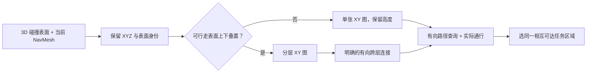

# 当前巴黎地图连通与高度勘察

2026 年 10 月 7 日。用户优先级：先确定出生点、任务候选点与敌军位置相互可达，再定任务地点。本工作先于[任务设计](MISSION_LOOP_DESIGN_20261007_ZH.md)中的 S/A/B/C。[英文原文](MAP_CONNECTIVITY_IMPLEMENTATION_20261007.md)与本版本同步。

## 范围与证据边界

只读分析及有限的编辑器／运行勘察。保护地图、模型、握姿、原动作、枪械逻辑、AI 包、供应商碰撞、NavMesh 范围／配置和 Catalog。不保存、不重建、不增加 NavLink、不靠传送通过、不发布资产或提交推送。引擎入口前检查 Git／外部资产状态和最新 B 交接；不与其他引擎并行，不终止其他任务或用户拥有的引擎。

明确采用当前授权地图 `9ff18c1339ee1de61add8a15acebd56512617ed69547de668b7d59ee1772d65b` 和 703 行保护清单，核对当前字节，不能使用旧 Catalog 地图。这是带日期的快照，后来验证的新版本优先。

已读[失败索引](../../../Failures/README.md)、[NI001](../../../Failures/NI001-20261006-npc-combat-adapter/FAILURE_ANALYSIS.md)、[NI002](../../../Failures/NI002-20261007-formal-npc-startup/FAILURE_ANALYSIS.md)、[NI003](../../../Failures/NI003-20261007-npc-acceptance-fixtures/FAILURE_ANALYSIS.md)、[导航基础结果](../PARIS_NAVIGATION_FOUNDATION_RESULT_20261002.md)、现有勘察／导航源码及保留回执。NI003 要求投影／路径查询与实际走通分开、角色朝向与控制旋转分开，ensure 不能算通过。NI002 证明加载后会主动交战，因此几何查询在非 PIE 的编辑器世界完成，不消耗人员。NI001 证明生命周期重置不会补弹。

**本次改变：**检查地点之间的双向路径，保留 XYZ 和高度不确定性，区分几何／NavMesh／实际移动证据，明确未检查的高度。不能从俯视图或单一起点向外的路径推断相互连通。

**早期检查：**保护字节精确一致；六名保存角色唯一；用 ObjectIterator 取得编辑器实际世界唯一导航实例；核对真实 Agent；每人脚底投影不串到其他表面；拒绝部分路径并记录全部 30 条有向人员路径。自身路径单独处理，因为 Unreal 会把单点路径标为 invalid。

**停止条件：**保护变化、竞争引擎、世界／导航接收者不明确、Error/Fatal/ensure、投影到错误表面、必需路径缺失／部分连通或实走失败。保留失败证据，标记未决／不可用并停止采用，不修改碰撞／范围、不任意扫偏移、不放宽验收。查询失败本身是有效的负面勘察证据；脚本／API／日志出错则整次查询无效。

## 旧证据为什么不能确定高度与相互可达

历史 `NavigationFoundation/fresh_v4` 使用旧 `4c77844f...72c620` 地图。六人都能投影，玩家到五名 NPC 的路径完整，但没查反向和所有两两路径。样本中有 391 个完整目的地、1,157 个部分目的地、51 个不能投影的候选，以及一个玩家到自身的单点。这些是历史观察，不是当前任务验收。

射线大约从世界 Z=504 厘米向下，仅保留低处街面命中；保存的 NavMesh 诊断范围是世界 Z=-300 至 700 厘米，XY 为 420 × 420 米。因此既没覆盖高处楼层，也不能证明地图没有纵向通路。旧回执的完整路径节点世界高度为 60 至 400.756 厘米；地形／桥／碎石高差不能直接称为楼层。物体包围盒、“bridge/roof”名称和看得见的楼房也不能证明楼梯或室内可用。

## 表示方法决定

采用**2.5D 勘察视图：XY 平面 + 真实表面高度 + 表面／层身份 + 已确认的连接**。路线仍由 Unreal 原有三维 NavMesh／MoveTo 负责；这是检查与导出格式，不新增自写 A* 依赖。

若选定区域的每个 XY 只有一个可行走面，就显示一张带高度颜色的二维图。若同一 XY 存在上下叠置的可达表面，就拆成不同层，只通过检查并实走的楼梯、坡道或其他允许连接相连。连续街道坡度不算新楼层；不能把 Z 按固定层高取整来决定分层。有碰撞但没有通路的屋顶保持排除／未知，不算可达楼层。

## 勘察顺序

| 步骤 | 产出 | 门槛／局限 |
| --- | --- | --- |
| C0：旧数据分析 | 源哈希、XY 查询状态图、终点／路径节点高度及局限。 | 不启动引擎，不声称当前路线已过；图上标旧地图和粗采样间距。 |
| C1：当前保存地图查询 | 当前地图／Agent／范围；六人的脚底／身体坐标；30 条有向人员路径；多高度投影样本、出去／返回状态及路径高度。 | 不 PIE、不保存；调用实际导航实例，拒绝部分路径。稀疏采样不是完整 NavMesh 多边形提取，也不能证明所有楼层都找到了。 |
| C2：纵向结构检查 | 俯视／侧视，楼梯／坡道／桥／开口候选，可站立碰撞面和头顶净空，同 XY 上下表面及连接方向。 | 超出旧低高度过滤检查。现有导航范围之外的高处结构明确标为当前 NPC 导航未覆盖，不能说不存在；窄入口／台阶要更细局部检查。 |
| C3：实际通行 | 原胶囊双向走过连接／地点边，记录真实位置、到达、坡度／台阶、净空、阻塞，两名盟军同时过瓶颈。 | 查询通过不能替代本步。独立未保存的有限夹具须在开战前抑制自动战斗，保留原资产资源；不逐帧驱动姿态、不修碰撞、不在任务中复活、不靠传送到达。人工玩家输入测试另记。 |
| C4：地点准入 | 出生点、Reach 入口、敌军原位／巡逻／搜索／支援点属于同一已验证互通区域。 | 选定连接 C1–C3 通过前不定任务位置；排除无法上下通行的高处敌人和看似可走的孤岛。 |

C1 在现有导航窗口中使用粗 XY 采样、多个 Z 种子和明确的小投影范围。只有 XYZ 表面一致才去重，不能按 XY 合并。C2 仍要检查 NavMesh 之外的高处候选结构；沿真实入口／连接／缺口加密检查，不能从粗网格推出全城或全部楼层结论。

## 连通契约与准入矩阵

对出生 S、任务入口 A/B/C 和敌军 E1/E2/E3 记录**有向**矩阵。每格保存 Agent、两端表面身份、有效／部分路径、长度和状态：未测／仅查询通过／实走通过／失败。两边都要可达；单向落差或链接不能自动当作往返。可用任务集合必须属于同一支持角色规格下的强连通区域，只有玩家能过不能准入 NPC 目标。

有限连接图的保留连接边完成双向实走后，可以用图上的传递关系确认相互可达，保留各边回执。仍须查询所有选定地点对并实走任务路线，包括小队同时阻塞。敌军交战距离、视线和射线遮挡与导航连通分开。Clear 标记不是新增实体，要检查接战空间及敌军／支援／搜索地点。

本计划不选定任务地点。当前六人保存位置是第一组查询对象；新增任务位置之后从勘察区域中选择。此前失败的西侧队形目标继续保留为失败证据，不作为默认任务位置。

## 存储与完成条件

### 有限 C2/C3 夹具

C1 回执干净通过后，检查与玩家连通区域接触的同 XY 上下样本及最高双向可达样本。记录简单／复杂向下表面命中、角色／网格／碰撞配置和未保存的侧视／俯视截图。这些是几何诊断，不是全图净空证明。

只测试通行：按照已有 B 夹具方法，在未保存的暂存世界、PIE 前隐藏六名原角色，防止开局感知交火。等待五个原已选装备初始化完成，要求原 100 生命、2/16 弹药、零射击。通过现有适配器关闭战斗、停止原生行为树，再显示角色。之后只用原生 AIController MoveTo；保留源模型／握姿／动作／胶囊。观察器采样位置，不驱动姿态、不逐帧移动角色。

一名原盟军和一名原德军分别走过保存地点的环路及反向，并步行回自己的原位。已被其他角色占用的地点采用 80 厘米接近容差，不让两具身体重叠；这是接近地点的实走证据，不是站进别人的中心。再让盟军尝试 C1 最高双向可达样本并走回，空目标采用更严格的 30 厘米容差。每段拒绝部分路径，设置与长度有关的有限期限，必须回到 Idle，实际 XY／脚底高度符合，生命／弹药／射击数不变。不传送、不重置、不补给。失败立即记录，不自动换点或修拟合。上下表面关系只有几何与移动一致后才能形成确认结论。

结束 PIE，恢复暂存可见性和后台节流，只关闭本任务进程并核对全部 703 保护。此测试隔离导航，不建立原 BT／完整动作／接触／FP 输入／FPS 验收。之后选定任务瓶颈的两名盟军同时通行，以及尚未采到的高处结构仍须另查。

源码工具、Markdown／SVG 放可入 Git 的源目录。JSON 回执、截图、栅格图和原日志放 ignored 私有 `Evidence/MissionConnectivityV1/<identity>/` 唯一目录，记录大小和哈希并保留旧尝试；引擎启动使用源码快照。当前 B 保护清单只是只读依赖，本勘察不改写。新失败沿用既有归档／索引规则。

完成需要当前地点矩阵、明确的可用纵向拓扑（或排除／未决楼层）、连接检查证据、实走和最终地点准入。C0/C1 不能声称全图互通或任务已就绪。其他 B 引擎占用期间，先推进 C0／工具／文档，原生步骤等待释放。
