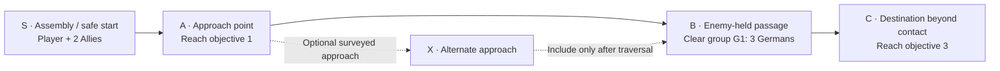
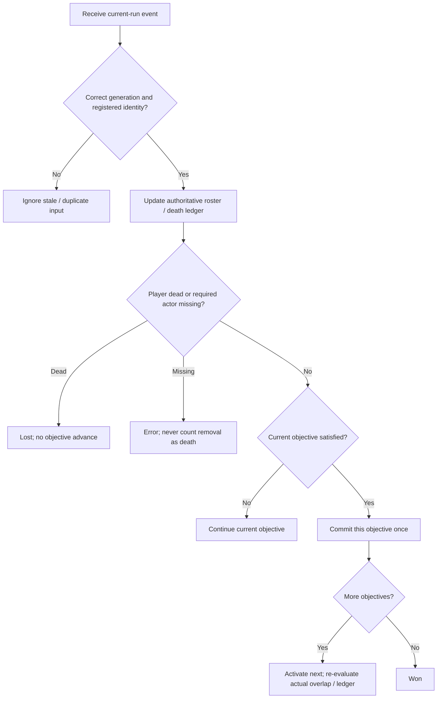
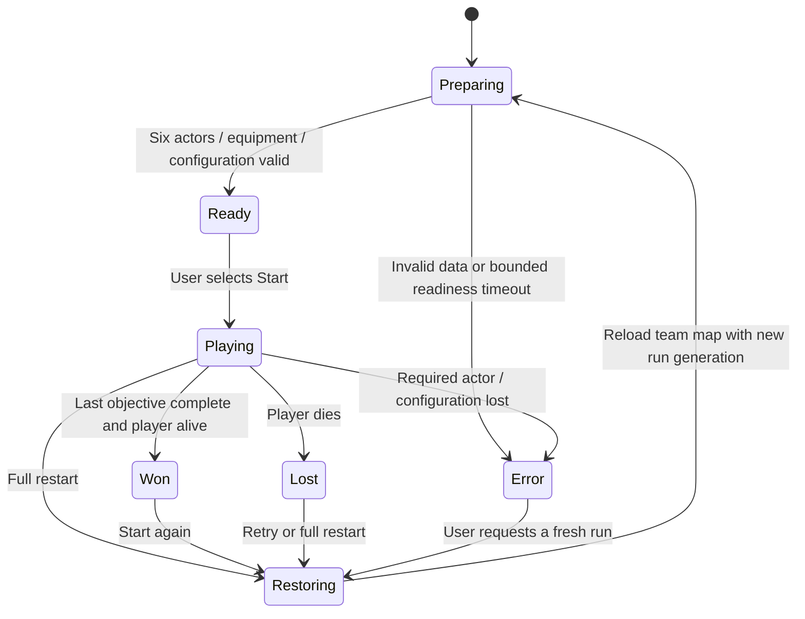

# Paris mission loop — design V1

7 October 2026. Status: design for review; no mission assets authored and no runtime acceptance claimed. Chinese review: [synchronized translation](MISSION_LOOP_DESIGN_20261007_ZH.md).

**Latest user route decision, 7 October 22:25 EDT:** start the Allied squad across the river, cross a bridge first and advance to capture a city centre position, with finite enemies along the way. Follow the [bridge-to-centre design](BRIDGE_TO_CENTRE_MISSION_DESIGN_20261007.md) for the preferred route and initial three-enemy distribution; its optional approach kills and final Clear/occupation replace the generic stage table below. Exact coordinates and integrated route acceptance remain pending. The lifecycle/restart sections below remain applicable.

**User priority update, 7 October:** establish mutual connectivity and usable vertical surfaces before selecting the route. Follow [the connectivity/height survey](MAP_CONNECTIVITY_IMPLEMENTATION_20261007.md). S/A/B/C remain unset; the 2.5D inspection view preserves XYZ and confirmed connectors rather than flattening possible floors.

## 1. Decision and boundary

Build a complete, configurable squad mission across connected roads in the existing Paris city: **prepare → start → approach → clear the assigned enemy group → reach the destination → debrief**. Death offers retry; full restart is available during play and after either outcome. Assignment 3 V1 implements initial-state retry. Safe-boundary checkpoint restoration is a subsequent Should increment, not a prerequisite for this first loop.

The proposed fiction is opening a passage for the squad during the August 1944 liberation setting. It is a gameplay premise, not an authenticated historical encounter. Exact date, unit, enemy formation and weapon variants remain subject to the existing history review. No new character, weapon, animation, vehicle, door, destructible objective or cinematic is needed.

Preserve accepted FP V21/V20, Allied formal V18/V16, German formal V14/V11 + FineWoodV15, their source rigs/weights/materials/actions, and existing guarded fire/reload/damage transactions. Initial population remains one player, two Allies and three Germans. Deaths and spent ammunition persist throughout a run; no new waves or replacement soldiers.

The current local map is `LV_ParisStreetCombat_V1`, 2,720,990 bytes, SHA-256 `9ff18c1339ee1de61add8a15acebd56512617ed69547de668b7d59ee1772d65b`. The B ledger has 703 protection rows including the two aliases of this one map. The AI closure is still in progress in the handoff snapshot. Recheck later verified records before implementation; do not restore an older Catalog map or mistake this design for a new asset/publication epoch.

## 2. Evidence and failure cases read

The governing inputs are [Assignment 3 goal](../ASSIGNMENT3_GOAL_V1_EN.md), [acceptance](../ASSIGNMENT3_ACCEPTANCE.md), [technical design](../../Design/TECHNICAL_DESIGN.md), [Assignment 2 proposal](../../Proposal/CS549_Assignment2_Proposal.md), [pipeline](../../../DEVELOPMENT_PIPELINE.md), [handoff](../../../HANDOFF.md), and the source `Docs/Assignment 3_ MVP Development.docx`.

| Read evidence | Consequence for this attempt |
| --- | --- |
| [Failure index](../../../Failures/README.md) and [NI001](../../../Failures/NI001-20261006-npc-combat-adapter/FAILURE_ANALYSIS.md) | Reuse original action transactions. A lifecycle reset is not an ammunition reset; do not refill fields to make a test pass. |
| [NI002](../../../Failures/NI002-20261007-formal-npc-startup/FAILURE_ANALYSIS.md) | The current saved layout fights during startup. Gate combat and movement before their first admission; preparation must not spend the finite roster. Validate ordinary runtime with actual Python-disabled evidence. |
| [NI003](../../../Failures/NI003-20261007-npc-acceptance-fixtures/FAILURE_ANALYSIS.md) | Projection is not connectivity; a queried complete path is not successful physical movement. Verify both Allies together and actual player control rotation along the selected route. Observer errors invalidate a run. |
| [Navigation foundation](../PARIS_NAVIGATION_FOUNDATION_RESULT_20261002.md) | Historical survey found 391 complete connections and 1,157 partial ones; its 420 × 420 m diagnostic window and 352.544 m longest sampled path do not select a mission boundary, distance or duration. Revalidate on the current map. |
| [Formal AI result](../NPCInteractionV1/NPC_FORMAL_COMBAT_RESULT_20261007.md) and [closure plan](../NPCInteractionV1/NPC_ACCEPTANCE_CLOSURE_IMPLEMENTATION_20261007.md) | Use existing sensing, role behavior, reservations and original combat. Partial AI tests do not pass the complete mission or motion/performance gates. |
| `ParisBlueprintAuthoring.cpp::LifecycleFunctions` and `ParisReloadDraft.inl` | `PC_ResetLifecycle` advances actor generation/action ID, restores health and movement, and preserves ammunition. Reload callbacks already check actor transaction tokens. The mission needs its own session generation and complete-world restart. |

**Changed mechanism:** replace the implicit always-fighting scene with an explicit mission lifecycle, a sealed roster/death ledger, ordered objective evaluation and a verified restart entry. Add a mission permission boundary around existing AI decisions; do not refit assets or rewrite combat rules.

**Early acceptance check:** in a separate unsaved native staging entry, register all six actors and validate equipment, then remain Ready for ten game seconds. From initial creation through Ready, shots, damage, ammunition and casualties must remain unchanged; role movement must not start. Start once and confirm original player controls and NPC behavior resume. This is the first implementation gate, before saving a route or adding HUD polish.

**Stop condition:** stop on any premature combat/death, missing or duplicate roster member, incompatible binding, stale callback accepted, ammunition creation, partial/untraversable selected route, progression deadlock, unauthorized protected-byte change, or Error/Fatal/ensure. Preserve the failed identity and evidence; change the documented mechanism or reject the route before a distinct bounded attempt. No automatic asset fitting, endless position retries or relaxed guards.

## 3. Route and encounter proposal

The following is a **logical route schematic, not a surveyed overhead map**. S/A/B/C are roles to assign after surveying the current city. Their apparent spacing and connections encode no coordinates, scale, street names or travel time. Use a connected stretch across multiple existing road segments; do not restrict the mission to one block. A second approach is optional and must be independently traversed before inclusion.

| Stage | Player experience | Objective and NPC contract |
| --- | --- | --- |
| S: assembly | Brief text: “Advance with the squad, clear the passage, reach the destination.” Select Start when ready. | Six actors and their original equipment are ready. No combat or role movement during preparation. Select a start protected from immediate enemy sight by actual city geometry; no temporary invulnerability. |
| A: approach | Follow the current objective marker; Allies follow and regroup through corners. | `O1 Reach(A)` requires the living player. Use the route to expose movement, obstruction and squad navigation. Do not require both Allies to enter a trigger. |
| B: contact | Choose cover and engage; Allies request distinct support positions. | `O2 Clear(G1)` consumes the three registered Germans. Proposed placement: two guard positions and one short foot-patrol route using existing behavior. Final positions and patrol points require survey. No stage-triggered spawning. |
| C: destination | Advance beyond the cleared passage, then receive the result. | `O3 Reach(C)` requires the living player after O1/O2. Surviving Allies continue following. Neither Ally death nor slow formation arrival alone blocks success. |

Player death is the V1 gameplay failure condition. One or both Allies dying changes the casualty summary, not mission progression. An invalid registry/route/required actor loss is a technical Error, not a fictitious combat defeat. Friendly fire stays at the currently selected OFF setting; friendly bodies continue to block shots under the original rules.

### Survey record required before placing the mission

Record current map/config identity; overhead capture; each anchor's ground and body position; player-facing/control rotation; Reach volume bounds; G1 stable IDs and initial equipment/resources; patrol/search points; complete paths and actual player/two-Allies-together traversal; enemy routes; cover/visibility; bottlenecks; measured quiet/combat travel time. Reuse the original capsule and actor-based goal projection; do not change vendor collision to rescue a chosen location.

S must allow safe readiness and a readable approach. A must be connected to S and B. G1 must have reachable return/search locations and readable lines of fire. C must lie beyond the encounter and be reachable after it. An alternate route needs the same checks. Distance and pacing follow measurement; the required 2–3 minute course video is not a mission-duration constraint.

## 4. Objective progression

The mission owns `MissionId`, persistent `RunGeneration`, `Phase`, current objective index, registered stable actor IDs and a deduplicated death ledger. Each callback carries run generation, source actor identity and objective identity where applicable. Actor `RestoreGeneration`/`ActionID` remain separate original action guards; the mission must not overwrite them with its run token.

- **Reach:** accept only the registered living player in the configured volume. On activation, query actual overlap as well as future BeginOverlap events. NPCs, corpses and an earlier visit no longer overlapping cannot complete it.
- **Clear:** seal the exact nonempty G1 roster before Playing. Completion means each member has a valid recorded death and zero members are alive. Missing registration, unload, despawn or destruction without a valid death is an Error. A dead actor may subsequently be removed without deleting its ledger entry.
- **Earlier kills:** record all valid G1 deaths from the start of Playing, including kills by Allies. O2 can immediately complete on activation if all three were legitimately killed earlier. Neither an empty group nor a counter default of zero passes.
- **Ordering:** callbacks update state and request one deferred reconciliation after the frame's damage/death updates. Reconciliation checks player death before progress or final victory. Only the current objective commits once; re-evaluation may immediately complete an already-satisfied next objective, bounded by the finite objective count.
- **Terminal state:** Won/Lost freezes further mission outcomes and new combat/movement admission. Cancel transient actions through their existing guarded endpoints. A reload transfer already committed remains spent/transferred; cancellation cannot refund or double-commit it. Late callbacks cannot change the result or another run.

The result screen reads the ledger: outcome, objectives completed and surviving/defeated roster. It does not infer deaths from actors visible on screen.

## 5. Lifecycle and startup gate

The saved FormalCombatV1 controller currently runs its tree at BeginPlay and `PC_BootstrapCombat` enables combat after configuring equipment. Pausing it after a delayed mission callback is too late. A future MissionV1 derived controller/tree wrapper must let the retained native bootstrap run while **all combat and role movement admission requires `BootstrapReady && Phase == Playing`**. It must also cover the player's attack/move/reload requests before Start. This permission boundary is new proposed work, not an existing proven API.

Share only mission phase/permission; keep targets, sight memory, paths and action state per NPC. On Start, initialize the current run's role/transient perception state and release all five brains and player controls together. No Python pose/behavior driver or manual equipment reconstruction. Keep the original bootstrap's failure reporting; use a configurable bounded mission readiness deadline and enter Error rather than waiting forever.

The MissionController is the only objective/outcome writer. No Level Blueprint trigger may independently win the mission, refill ammo or revive a body.

## 6. Retry, full restart and later checkpoints

| Entry | V1 behavior | Later checkpoint increment |
| --- | --- | --- |
| Retry after death | Label: “Retry from start”; reload the configured team map. | Restore latest valid safe snapshot; fall back to initial state only when none exists. A corrupt/incompatible snapshot is reported, not silently applied. |
| Full restart during/after play | Always reload the initial mission configuration. | Always initial state, even when a checkpoint exists. |
| Objective advance | Retain actual health, ammo, deaths and actor positions. | Same; optional saving changes no gameplay resources. |

**V1 chooses complete map reload**, rather than trying to restore the entire world with `PC_ResetLifecycle`. A proposed Blueprint GameInstance session retains a monotonically increasing run generation and requested mission configuration across world travel. Before travel, lock inputs/AI, unbind old events, cancel owned actions/timers/effects/moves and release reservations. World teardown disposes the remaining transient actors, including owned rifles/adapters. The new world registers the same stable roster IDs against new actor references and checks its initial configuration before enabling Start.

Verify no duplicate policies, rifles, controllers or coordinator; no surviving old target/reservation/timer callback; correct player/controller transform; all health/alive/ammunition values equal the declared initial configuration; O1 active and G1 fully registered. Fresh map loading intentionally returns to initial resources for a new attempt. During normal play, no reset/refill is performed. Reload latency is measured separately from warmed gameplay FPS.

For checkpoints, propose the boundary after G1 is cleared and before the final transit, **only if live threat/visibility/navigation checks establish a safe site**. Persist mission/config version, objective index, player transform/control rotation/health/ammo and every relevant NPC stable ID, alive/dead status, health/ammo, transform and role configuration. Restore those exact values, roll back later changes and reinitialize transient actions/perception/reservations under a new generation. Saving does not heal/refill/revive; bodies dead in the snapshot remain dead. A body killed only after the snapshot returns to its recorded living state when that later history is rolled back. Mid-reload snapshots are excluded from this first checkpoint design.

## 7. Planned Blueprint and UI ownership

Names below are proposals; no package exists merely because it is listed here. Put new team packages under `/Game/ParisCombat/Mission/MissionV1/`.

| Proposed item | Responsibility |
| --- | --- |
| `DA_PC_ParisMissionV1` plus objective/roster structs | Ordered Reach/Clear definitions, expected stable IDs/groups, initial actor configuration, surveyed anchors and bounded readiness settings. Avoid commercial asset copies. |
| `BP_PCMissionControllerV1` | Registry seal, phase, event subscription, death ledger, ordered reconciliation, UI data and terminal transitions. |
| `BP_PCMissionReachVolumeV1` | Report the registered player's overlap; never write progress independently. |
| `BP_PCMissionSessionV1` (GameInstance) | Cross-world run generation and restart request; later checkpoint compatibility metadata. |
| Mission controller/tree/player admission adapters | Bootstrap outside Playing; original role/combat behavior inside Playing. Use existing guarded transactions; preserve originals as dependencies. |
| Mission HUD/result extension | Objective text/progress/marker, preparation/Start/error/outcome and explicit retry/full-restart entries. Read health/ammo from existing authoritative HUD state. |

During play show **one current objective**, its marker/distance and authoritative health/ammo. For O2, show the assigned group's living count, e.g. “Clear the passage · 2 remaining.” Do not promise an enemy's location through walls or display hidden targets. The Ready panel shows the short mission brief and Start; Lost shows the failure and Retry from start; Won shows the summary and Start again. Provide full restart through the task menu during play. Binding/menu implementation is part of later UI work, not a new pause-system requirement.

A later implementation may add only these packages and the necessary team-map actor/configuration changes. Before any native writer, refresh B closure/ownership/process state, explicitly adopt the current map/703 epoch, create verified recovery and a separate bounded authoring plan. New saved bytes require a new truthful guard inventory. This document does not authorize changing the formal map now, publishing SFTP/Git assets or launching a competing engine.

## 8. Implementation order and acceptance

| Increment | Concrete output | Gate before continuing |
| --- | --- | --- |
| M0: current-map survey | Overhead/path/physical-traversal record and selected S/A/B/C, plus optional alternative. | Player and both Allies together traverse retained routes; German patrol/search/return points are reachable. Reject the problematic west lane unless a new clean physical traversal proves it. |
| M1: smallest lifecycle slice | Unsaved registry, startup admission and Start → Playing → forced fresh-run entry. | Early Ready check in section 2; duplicate/missing equipment fails closed. Original actions still run after Start. |
| M2: objectives and outcome | O1/O2/O3, death ledger, ordered arbitration and authoritative objective/result UI. | OBJ-01/UI-01: already-overlapping Reach, early kills, duplicate deaths, empty/incomplete group, removal without death, death/exit same frame. |
| M3: complete restart | Persistent run token and verified full-map reload, input/actions/AI cleanup. | RESET-01: restart during approach, partial contact, reload, Won and Lost; inject old callbacks after restart. Run three complete missions/restarts without duplicates, resource creation or navigation/progression deadlocks. |
| M4: current playable increment | Fresh ordinary runtime and Windows package using the exact selected mission. | LOOP-01/BUILD-01: human-played full loop; actual interpreter disabled/bridge absent; original collision/ammo/death rules preserved; clean logs and declared build identity. Then warmed route/performance and finite stress tests. |
| M5: optional safe checkpoint | Exact SaveGame snapshot/restore. | SAVE-01: later damage/ammo/death/objective changes roll back exactly; saved casualties persist; full restart ignores snapshot; incompatible data rejected. Defer explicitly if not ready. |

Animation, collision, navigation and AI demonstrations come from the mission's actual actions/cover/corners/support/search. Preserve separate pillar comparisons and manual motion/near-wall/recoil review; a successful mission loop does not pass those gates automatically. Package/performance, second-machine restoration, public delivery rights and course prerequisite evidence remain separate.

## 9. Storage, failure record and result status

Markdown and Mermaid design stay in this source folder. Future native assets use the existing private writable workspace and recorded runtime aliases; raw captures/logs/receipts use a unique private `Evidence/MissionLoopV1/<identity>/` entry. Do not overwrite an earlier identity or republish commercial assets. A failed attempt receives `Failures/MLxxx-<date>-<cause>/FAILURE_ANALYSIS.md`, an index link, source/package hashes, retained receipt/recovery paths, observed cause versus hypothesis, changed mechanism and next stop boundary. Move only verified retired candidates with no live dependencies; protect selected assets and user-owned previews.

This design turn changes documents only. No route has been selected in the editor, no mission/native asset has been saved, and LOOP-01/OBJ-01/RESET-01/UI-01/SAVE-01 have not been run. Next actionable package is M0 followed by M1, after checking the latest B acceptance checkpoint and native ownership.
