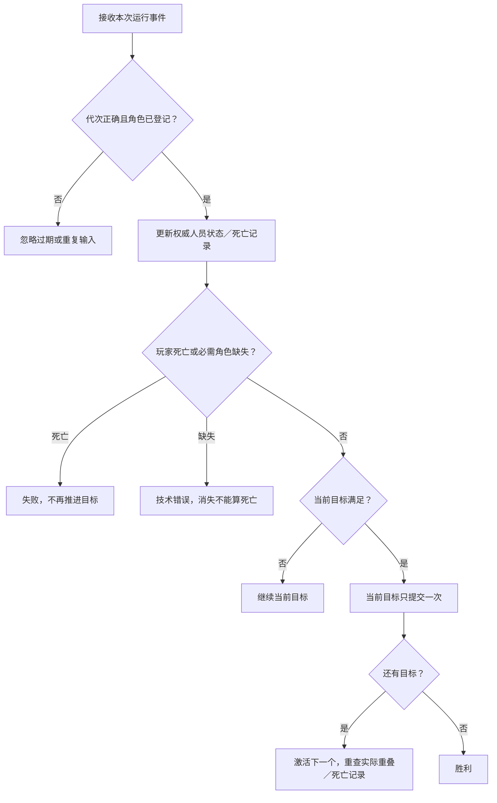
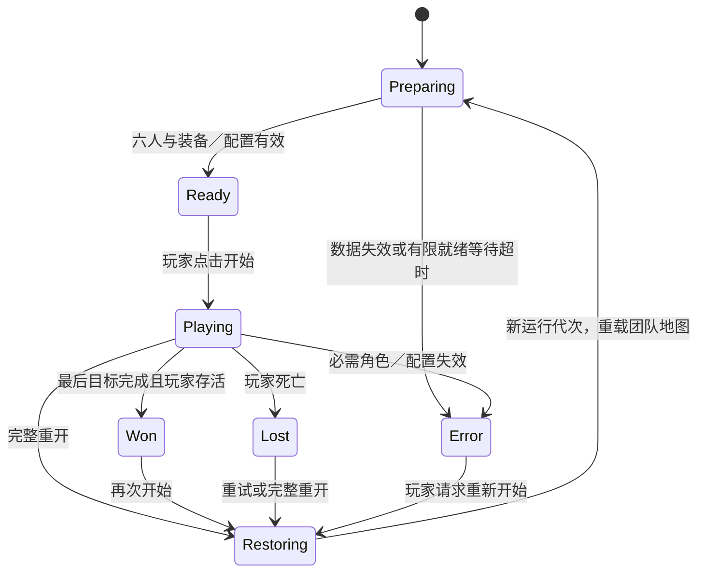

# 巴黎任务闭环——设计 V1

2026 年 10 月 7 日。状态：供审阅的设计，尚未制作任务资产，不代表运行验收通过。[英文原文](MISSION_LOOP_DESIGN_20261007.md)与本中文版本同步。

**10月7日22:25 EDT最新路线决定：**盟军从河对岸出发，先过桥，再推进占领市中心，并在途中设置有限敌军。以[过桥进城方案](BRIDGE_TO_CENTRE_MISSION_DESIGN_20261007_ZH.md)作为优先路线及初始3敌军分布；其中沿途击杀可选，最终清除守军／占领替代下文通用阶段表。具体坐标与整条路线集成验收仍待完成；下文生命周期／重开设计继续适用。

**10 月 7 日用户优先级更新：**先确认相互连通与可通行的纵向表面，再选路线。执行[连通／高度勘察](MAP_CONNECTIVITY_IMPLEMENTATION_20261007_ZH.md)。S/A/B/C 暂不定点；2.5D 检查图保留 XYZ 与确认的连接，不能直接压平可能的楼层。

## 1. 本次决定与边界

在现有巴黎城市的连通道路中建立可配置的小队任务：**准备 → 开始 → 接近 → 清除指定敌组 → 抵达终点 → 结算**。玩家死亡可以重试；进行中和结算后都能完整重开。Assignment 3 首版先实现从开局重试；安全目标边界的检查点恢复作为后续 Should 增量，不阻塞首个闭环。

任务叙事拟为：在 1944 年 8 月巴黎解放背景下，为小队打通一段通路。这是玩法设定，尚不是经过史料认证的具体战斗。准确日期、部队、敌军编制和武器型号继续按现有历史审查要求确认。无需新角色、武器、动画、车辆、门、破坏目标或过场。

保留已接受的 FP V21/V20、盟军正式 V18/V16、德军正式 V14/V11 + FineWoodV15，以及原模型、骨架、权重、材质、动作和已验证的射击／换弹／伤害事务。初始人数仍为玩家一人、盟军两人、德军三人。一次任务内，阵亡和弹药消耗持续保留，不增加波次或替补士兵。

当前本地地图为 `LV_ParisStreetCombat_V1`，2,720,990 字节，SHA-256 为 `9ff18c1339ee1de61add8a15acebd56512617ed69547de668b7d59ee1772d65b`。B 保护清单共 703 行，包含同一地图的两个别名。交接快照仍把 B 验收记为进行中；实施前优先读取后来验证的记录。不得恢复旧 Catalog 地图，也不能把本设计当作新的资产或发布版本。

## 2. 已读依据与失败案例

本设计依据[Assignment 3 目标](../ASSIGNMENT3_GOAL_V1.md)、[验收清单](../ASSIGNMENT3_ACCEPTANCE.md)、[技术设计](../../Design/TECHNICAL_DESIGN.md)、[Assignment 2 提案](../../Proposal/CS549_Assignment2_Proposal.md)、[开发流程](../../../DEVELOPMENT_PIPELINE.md)、[交接](../../../HANDOFF.md)和原始 `Docs/Assignment 3_ MVP Development.docx`。

| 已读记录 | 本次如何避免重复失败 |
| --- | --- |
| [失败索引](../../../Failures/README.md)与[NI001](../../../Failures/NI001-20261006-npc-combat-adapter/FAILURE_ANALYSIS.md) | 使用原动作事务。生命周期重置不等于弹药重置；不能直接补弹让测试通过。 |
| [NI002](../../../Failures/NI002-20261007-formal-npc-startup/FAILURE_ANALYSIS.md) | 当前正式布局加载时就会交火。必须在第一次动作获准前控制战斗和移动，不能让准备阶段消耗有限人员。普通运行还要确认解释器实际禁用。 |
| [NI003](../../../Failures/NI003-20261007-npc-acceptance-fixtures/FAILURE_ANALYSIS.md) | 能投影不代表连通；查询到完整路径也不代表角色实际能走通。选定路线要验证两名盟军同时通过及玩家实际控制朝向。观察器报错会使整次运行失败。 |
| [导航基础结果](../PARIS_NAVIGATION_FOUNDATION_RESULT_20261002.md) | 历史勘察有 391 条完整连接、1,157 条部分连接；420 × 420 米诊断窗口和最长样本 352.544 米都不是任务边界、距离或时长。当前地图必须重新验证。 |
| [正式 AI 结果](../NPCInteractionV1/NPC_FORMAL_COMBAT_RESULT_20261007.md)与[验收收尾计划](../NPCInteractionV1/NPC_ACCEPTANCE_CLOSURE_IMPLEMENTATION_20261007.md) | 接入现有感知、角色行为、占位协调和原战斗。部分 AI 测试不能代替完整任务、动作或性能验收。 |
| `ParisBlueprintAuthoring.cpp::LifecycleFunctions` 与 `ParisReloadDraft.inl` | `PC_ResetLifecycle` 增加角色代次与动作 ID，恢复生命和移动，但保留弹药。原换弹回调已有事务令牌检查；任务另需跨地图的运行代次和完整重开入口。 |

**本次改变的机制：**把默认持续交战场景接成明确的任务生命周期、封闭人员登记表、死亡记录、顺序目标判断和可验证的重开入口。在原 AI 决策外围增加任务许可边界，不重新拟合资产或改写战斗规则。

**早期验收：**在单独、未保存的原生暂存入口中登记六人并确认装备，然后保持 Ready 十个游戏秒。从角色创建到 Ready，射击数、伤害、弹药和伤亡必须不变，角色行为移动不能启动。点击一次开始，确认原玩家操作和 NPC 行为恢复。这是保存路线或润色 HUD 前的第一道实施门槛。

**停止条件：**出现提前交火／阵亡、人员漏登或重复、装备不兼容、旧回调被接受、凭空增加弹药、选定路线部分连通或实走失败、任务推进死锁、未经授权的保护字节变化、Error/Fatal/ensure，立即停止。保留失败身份和证据，先修订机制或淘汰路线，再做不同身份的有限尝试。不得自动修改模型、无限重试坐标或放宽保护条件。

## 3. 路线与战斗设计

下图是**任务逻辑示意，不是已经勘察的俯视地图**。S/A/B/C 表示之后要在当前城市中选取的地点职责；间距和连线不表示坐标、比例、街道名或通行时间。使用跨多个现有道路段的连通区域，不把任务限制在一个街区。第二条接近路线可选，必须独立实走后才纳入。

| 阶段 | 玩家体验 | 目标与 NPC 规则 |
| --- | --- | --- |
| S：集合 | 简短任务说明：“与小队推进，清除通路，抵达终点。”准备好后点击开始。 | 六人及原装备就绪，准备阶段不开火、不启动角色移动。依据真实城市遮挡选择不会立即暴露在敌军视线中的起点，不提供临时无敌。 |
| A：接近 | 看当前目标标记推进，盟军在转角跟随与重组。 | `O1 Reach(A)` 要求活着的玩家到达。通过路线展示移动、遮挡和小队导航；不要求两名盟军都进入触发区。 |
| B：接战 | 利用掩体交火，盟军申请不同支援位置。 | `O2 Clear(G1)` 对应三名已登记德军。拟采用两处守卫位置和一条短步行巡逻，复用现有行为；具体位置和巡逻点由勘察确定。切换阶段不刷兵。 |
| C：终点 | 通过已清除的通路继续前进，抵达后结算。 | `O3 Reach(C)` 需在 O1/O2 后由活着的玩家完成。幸存盟军继续跟随；盟军阵亡或队形到达慢本身不阻止胜利。 |

首版的玩法失败条件是玩家死亡。一名或两名盟军阵亡会影响结算伤亡，但不改变任务目标。登记、路线或必需角色失效进入技术 Error，不伪装成战斗失败。友伤保持当前 OFF 设置，友军身体仍按原规则阻挡射击。

### 正式摆放前必须形成的勘察记录

记录当前地图／配置版本、俯视截图、各点地面与角色位置、玩家朝向与控制旋转、Reach 触发区范围、G1 稳定身份及初始装备资源、巡逻／搜索点、完整路径和玩家／两名盟军同时实走、敌军路线、掩体视线、瓶颈，以及无战斗／有战斗的实测通行时间。保留原胶囊和角色目标投影方法，不能修改供应商碰撞来迁就一个预选地点。

S 要能安全准备并读懂接近方向；A 要连通 S 和 B；G1 要有可达的返回／搜索点和可判断的射线；C 要位于接战之后并能通过。备选路线接受同样检查。距离和节奏以实测为准，课程要求的 2–3 分钟视频不等于任务时长。

## 4. 目标推进规则

任务持有 `MissionId`、跨地图保留的 `RunGeneration`、`Phase`、当前目标序号、已登记稳定角色身份和去重死亡记录。每个回调携带运行代次、来源角色身份，以及需要时的目标身份。角色原有 `RestoreGeneration`／`ActionID` 继续保护原动作事务，不能用任务代次覆盖它们。

- **抵达：**只接受登记过且存活的玩家进入配置区域。激活时检查当前重叠，也监听后续 BeginOverlap。NPC、尸体，以及曾经到过但现在已经离开的玩家都不能完成目标。
- **清除：**开始前封闭登记确切、非空的 G1 名单。每个成员都有有效死亡记录且存活数为零才完成。漏登、卸载、消失或没有有效死亡记录就销毁属于 Error；正常死亡后清理角色不会删除死亡记录。
- **提前击杀：**从 Playing 开始记录所有有效 G1 死亡，盟军击杀也算。若三人已提前合法阵亡，O2 激活时可以立即完成。空组或默认计数零不能通过。
- **判定顺序：**事件更新状态，在本帧伤害／死亡更新完成后统一判定一次；先检查玩家死亡，再检查目标和胜利。只提交当前目标一次；新目标若已满足可立即完成，但循环次数受有限目标总数约束。
- **结束状态：**Won/Lost 固定结果并关闭新的战斗／移动许可。通过原有受保护入口取消临时动作；已提交的换弹转移继续保留，取消不能退款或重复转移。晚到回调不能修改结果或下一次运行。

结算读取死亡记录，显示结果、完成目标数和幸存／阵亡人员，不能根据画面中还剩几个角色推断伤亡。

## 5. 生命周期与开局许可

当前 FormalCombatV1 控制器在 BeginPlay 启动行为树，`PC_BootstrapCombat` 配好装备后就启用战斗。等任务回调晚些时候再暂停已经太迟。之后的 MissionV1 派生控制器／行为树外围需要让原生装备初始化继续运行，但**战斗与角色移动必须同时满足 `BootstrapReady && Phase == Playing`**。玩家开始前的攻击、移动和换弹请求也受该许可约束。这是需要新增的设计，不是声称现有接口已经验证。

共享的只有任务阶段／许可；目标、视线记忆、路径和动作状态仍属各 NPC。开始时初始化本次运行的角色行为和临时感知状态，然后一起放开五个 AI 与玩家操作。不使用 Python 姿态／行为驱动或手工重造装备。保留原初始化失败报告；任务就绪等待配置有限期限，超时进入 Error，不无限等待。

MissionController 是唯一的目标／胜负写入方。关卡蓝图触发区不得自行宣告胜利、补弹或复活角色。

## 6. 重试、完整重开与后续检查点

| 入口 | 首版行为 | 后续检查点版本 |
| --- | --- | --- |
| 死亡后重试 | 明示“从开局重试”，重新载入配置的团队地图。 | 恢复最近有效的安全快照；没有快照才回初始状态。损坏或不兼容的快照要报错，不能悄悄应用。 |
| 进行中／结算后完整重开 | 永远恢复初始任务配置。 | 即使已有检查点，也恢复初始配置。 |
| 完成一个目标 | 保留真实生命、弹药、阵亡和位置。 | 相同；可选的保存本身不改变资源。 |

**首版采用整张任务地图重新载入**，不试图只调用 `PC_ResetLifecycle` 恢复整个世界。拟用蓝图 GameInstance 会话跨地图保留递增运行代次和待载入任务配置。切换前关闭玩家／AI 许可、解除旧事件绑定、取消自有动作／计时器／特效／移动并释放占位；世界销毁清理其余临时对象，包括自有枪械和适配器。新世界将相同稳定身份绑定到新角色引用，并验证初始配置后才允许开始。

核对没有重复策略、枪械、控制器或协调器，没有旧目标／占位／计时器回调遗留，玩家与控制器位置朝向正确，所有生命／存活／弹药等于声明的初始配置，O1 激活且 G1 登记完整。新尝试有意恢复开局资源；普通任务阶段不做重置／补给。重载等待时间单独测量，不混入预热后的游戏 FPS。

检查点候选边界为清除 G1 后、最终推进之前，**只有实际威胁／视线／导航检查确认安全，才选择地点**。快照包含任务／配置版本、目标进度、玩家位置／控制旋转／生命／弹药，以及相关 NPC 的稳定身份、存活／死亡、生命／弹药、位置和角色配置。恢复精确还原这些值、回滚之后的变化，并在新代次下重建临时动作／感知／占位。保存不回血、不补弹、不复活；快照里已死的角色保持死亡。只在快照之后死亡的角色，会随后续历史回滚恢复为快照中记录的存活状态。首个检查点设计不支持换弹中的保存。

## 7. 蓝图与 UI 职责

以下名称是拟新增项，列入设计不代表包已存在。团队新包放在 `/Game/ParisCombat/Mission/MissionV1/`。

| 拟新增项 | 职责 |
| --- | --- |
| `DA_PC_ParisMissionV1` 和目标／人员结构 | 顺序 Reach/Clear、稳定身份／敌组、初始角色配置、勘察点位和有限就绪设置，不复制商业资产。 |
| `BP_PCMissionControllerV1` | 封闭登记、阶段、事件绑定、死亡记录、顺序判定、UI 数据和结束状态。 |
| `BP_PCMissionReachVolumeV1` | 上报登记玩家的重叠，不独立推进任务。 |
| `BP_PCMissionSessionV1`（GameInstance） | 跨世界运行代次与重开请求，后续检查点兼容元数据。 |
| 任务控制器／行为树／玩家许可适配器 | Playing 外完成初始化，Playing 内执行原角色与战斗行为；复用原受保护事务，原资产保留为依赖。 |
| 任务 HUD／结算扩展 | 目标文字／进度／标记、准备／开始／错误／结果，以及明确重试和重开入口；生命弹药读取现有权威 HUD 状态。 |

游玩时只显示**一个当前目标**、其标记／距离和权威生命弹药。O2 显示指定敌组存活数，例如“清除通路 · 剩余 2 人”；不隔墙透视敌人位置或暴露隐藏目标。Ready 显示简短任务和开始；Lost 显示失败及从开局重试；Won 显示结算和再次开始。进行中通过任务菜单提供完整重开。菜单／输入绑定是后续 UI 实施内容，不要求另建暂停系统。

后续实施只新增上述包及必要的团队地图角色／配置变化。任何原生写入前，先更新 B 收尾／所有权／进程状态，明确采用当前地图和 703 保护版本，形成验证过的恢复副本与独立有限实施计划。保存新字节后必须建立真实的新保护清单。本文件不授权现在写正式地图、发布 SFTP/Git 资产或启动竞争引擎。

## 8. 实施顺序与验收

| 增量 | 具体产出 | 继续前的门槛 |
| --- | --- | --- |
| M0：当前地图勘察 | 俯视／路径／实走记录，选择 S/A/B/C 及可选路线。 | 玩家和两名盟军同时通过；德军巡逻／搜索／返回点可达。有问题的西侧通路，除非新实走干净通过，否则不选。 |
| M1：最小生命周期 | 未保存的登记、开局许可、开始 → Playing → 新运行入口。 | 第 2 节早期 Ready 检查；漏登／重复装备关闭许可并报错，开始后原动作可执行。 |
| M2：目标和结果 | O1/O2/O3、死亡记录、顺序判定、权威目标和结算 UI。 | OBJ-01/UI-01：激活时已重叠、提前击杀、重复死亡、空组／漏登、无死亡直接移除、同帧死亡与终点。 |
| M3：完整重开 | 持久运行代次、完整地图重载、输入／动作／AI 清理。 | RESET-01：接近、部分交火、换弹、Won、Lost 时重开；重开后注入旧回调。连续三次完整任务／重开，无重复对象、资源凭空增加或导航／推进死锁。 |
| M4：当前可玩增量 | 使用精确任务版本的新鲜普通运行和 Windows 包。 | LOOP-01/BUILD-01：人工完整游玩，解释器确实禁用／桥接不运行，原碰撞／弹药／死亡规则不变，干净日志和明确构建身份；之后测预热路线性能与有限压力。 |
| M5：可选安全检查点 | 精确 SaveGame 保存／恢复。 | SAVE-01：之后的伤害／弹药／死亡／目标变化精确回滚，快照内阵亡保留，完整重开忽略快照，不兼容数据拒绝；未就绪则明确延期。 |

四支柱演示来自任务里的实际动作、掩体碰撞、转角导航、支援与搜索。仍须保留独立支柱对比及人工动作／近墙／后坐力审查；任务完成不自动通过这些门槛。打包／性能、第二台机器恢复、公开交付权限和课程前置证明仍单独验证。

## 9. 存储、失败记录与当前结果

Markdown 和 Mermaid 设计放在本源文件目录。后续原生资产使用现有私有可写工作区及登记过的运行别名；截图／日志／回执使用私有 `Evidence/MissionLoopV1/<identity>/` 的唯一记录。不得覆盖旧身份或重新公开商业资产。失败尝试建立 `Failures/MLxxx-<date>-<cause>/FAILURE_ANALYSIS.md` 和索引链接，记录源／包哈希、保留回执／恢复路径、观察原因与假设、本次改变和下一停止边界。只移动已经确认淘汰且没有活动依赖的候选；保护已选资产和用户接管的预览。

本次只修改文档。未在编辑器中选定路线，未保存任务／原生资产，LOOP-01/OBJ-01/RESET-01/UI-01/SAVE-01 尚未运行。下一项可执行工作为 M0，之后 M1；开始前检查最新 B 验收与原生所有权。
