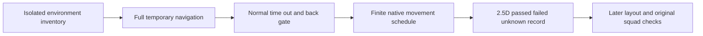

# Pure map connectivity test workflow

Latest addendum: read [static vehicle plan](PURE_MAP_STATIC_VEHICLE_PLAN_20261007.md) and ML007 before another entry. The failed dynamic-vehicle batch cannot be resumed blindly.

7 October 2026. The user requests a written workflow before isolated terrain execution. The [Chinese review](PURE_MAP_TEST_WORKFLOW_20261007_ZH.md) is synchronized. The original pre-execution plan and chronological corrections remain in [workflow history](PURE_MAP_TEST_WORKFLOW_HISTORY_20261007.md); this page consolidates the effective specification. Actual completion is reported in the [execution result](PURE_MAP_TEST_RESULT_20261007.md).

Establish where an independent default character can physically walk before placing the player, Allies, Germans or mission objectives. Every existing character coordinate is a temporary test position, neither a final anchor nor a survey boundary.

## Scope and protection

Use only an owned, unsaved in-memory map copy. Remove original characters, equipment, grip policies and combat coordinators, suppress the production GameMode and default player spawn, and retain environment collision and parked vehicles. Hidden actors still collide. Check direct classes and inheritance at runtime: production Blueprint and `/Script/Paris*` gameplay actors must be absent.

Adopt the formal 9ff map and current703 protected rows. Explicitly adopt the authenticated [local recoil DLL increment](../RecoilV1/AUTHORIZED_LOCAL_BINARIES_20261007.json) through the existing common.py three-path allowlist; the other700 rows, map, models, weights, materials, actions, fingers, weapons, AI and Catalog remain exact. Never restore historical DLLs or overwrite another window's work. No formal map save, production collision/config/NavLink change, asset adoption, commit or publication.

Inspect actual engine ownership before entry. Preserve user and foreign editors; only this task's processes may be stopped. Installed Epic template bytes, native helper binaries, raw JSON/logs and PNG remain private and ignored.

## Failure cases read and changed mechanism

Read AGENTS, HANDOFF, the [failure index](../../../Failures/README.md), navigation foundations and current map/height receipts.

| Case | Failure lesson | Different mechanism |
| --- | --- | --- |
| [ML001 occupied route](../../../Failures/ML001-20261007-map-connectivity-fixture/FAILURE_ANALYSIS.md) | Occupancy and terrain were mixed; leg8 lacked a native completion cause. | Isolate terrain and match numeric native request IDs/controllers; do not rerun the old loop. |
| [NI002](../../../Failures/NI002-20261007-formal-npc-startup/FAILURE_ANALYSIS.md), [NI003](../../../Failures/NI003-20261007-npc-acceptance-fixtures/FAILURE_ANALYSIS.md) | Startup combat, hidden collision, projection mistaken for reachability and invalid default navigation receivers. | Remove gameplay bodies, check runtime isolation, use the actual world navigation instance and physical locomotion. |
| [ML002 enum API](../../../Failures/ML002-20261007-pure-map-api/FAILURE_ANALYSIS.md) | Guessed Python enum stopped inventory. | Reflect CollisionResponseType.ECR_BLOCK and pass a separate inventory gate. |
| [ML003 navigation preflight](../../../Failures/ML003-20261007-pure-map-nav-preflight/FAILURE_ANALYSIS.md) | Loading lock prevented rebuild, vacant capacity looked invalid, settings alias was absent. | Wait for natural unlock, verify registered bounds, separate active/vacant slots and use installed reflected settings. |
| [ML004 cleanup](../../../Failures/ML004-20261007-pure-map-probe-cleanup/FAILURE_ANALYSIS.md) | Python controller cleanup failed and the first success was not committed; owned process was forcibly closed. | Native cleanup restricted to an exact native possessed probe/controller pair in one PIE world; first prove normal-time lifecycle and normal exit. |
| [ML005 native isolation](../../../Failures/ML005-20261007-pure-map-native-isolation/FAILURE_ANALYSIS.md) | A non-Character native FP bootstrap survived filtering and errored after60 game seconds. | Remove the entire project native namespace, check inheritance, and use live-log normal stop requests. Never resume or merge contaminated results. |

API/isolation failures are not terrain disconnections. Preserve original errors, forced exits and failed physical paths. A different mechanism uses a unique entry and passes the early gate before broad execution.

## Coverage denominator and map representation

**Surface-height admission addendum,16:15UTC, written before its execution.** Read [ML006](../../../Failures/ML006-20261007-pure-map-surface-height/FAILURE_ANALYSIS.md). Vertex-average center is not necessarily the detailed surface height at that XY. V7 closed normally; its7,311 records are diagnostics only, ineligible for resume/merge. Preserve raw center and polygon identity, derive a separate grounded sample through GetClosestPointOnPoly on that exact polygon, and require XY drift≤0.01cm. Never globally project to another nearby layer. Any exact-surface failure stops admission. Freeze a new surface-point schedule; the old28,602 denominator belongs to the historical center specification, while the new denominator follows actual export.

The new early gate runs two normal-time lifecycle legs and separately initializes the exact surface of problematic region_03597 once as a standing-only calibration. This is placement, not traversal or an extra main-schedule case. Keep the original XY/feet/overlap/CurrentFloor/native-ID/log/exit/703 gates. Broad fixed-step entry must match this new normal reference and exact-surface helper. A failed calibration stops this sampling mechanism, without Z offsets, search windows or tolerance compensation. This changes the height observation, not terrain or the old coordinate's result.

Continuation addendum,16:20UTC, before the next entry: V8's exact export passes with28,684 cases, but its newly selected shortest edge07016→07024 fails runtime query before standing calibration. Fix the lifecycle controls to the already verified LV_Proxy09517↔09829 pair at their exact surface points, without scanning alternatives. The failed07016→07024 is retained in the later ordered schedule as a prior rejection linked by raw receipt hash/case ID, never attempted again; its reverse remains independent. Numeric Recast polygon references are entry-local. Across entries match tile/surface geometry, region XYZ, adjacency and ordered cases, rather than treating changing local reference numbers as permanent identities.

Cache addendum before execution: independent comparison finds unchanged source XYZ for region_03541/03573. Old case07102 has a blocking overlap;07152 moves184.295cm XY/74.494cm feet away. A sampler-version change cannot authorize repeating those placements. Close V10 normally before reaching them with a typed owned stop request, and resume only its accepted clean exact-specification prefix. Audit the stop type/sole reason,exit0/log0/703exact and immutable prefix before permitting one cache-only source revision, preserving original script/request and old/new source hashes. Bootstrap these two source rejections with original receipt/case/standing provenance; derived negatives explicitly have no new physical attempt. This does not merge V7 positive movements into the new specification. Character parameters/helper/surface geometry/schedule and the existing5,000-plus accepted legs remain unchanged; later batches use the same corrected source.

The immediate owned closure actually retains5,500 accepted cases plus one ungraded initialization for next case_05500. Audit that extra separately as unknown, neither passed nor physically failed. Resume starts at the uncompleted case; the interrupted initialization is not traversal. Ordinary budget batches still close at the next case boundary.

V11 cache preflight stops before PIE: the first source is exactly equal;the second differs0.0000532645cm in Z, correcting the earlier exact-equality statement. Owned51116 exit0/log0/current703 exact;physical attempts0. Use≤0.001cm3D equivalence solely to inherit rejected placement, recording actual drift. This is not pass/arrival/feet tolerance, cross-entry frozen-coordinate tolerance or layer merging. Half-micron drift does not authorize retrying an unsafe source. V1 cache source/hash remain stopped-preflight history;the next unique entry uses V2 source hashes and V10's clean prefix.

Inventory all loaded environment levels. Bounds derive from components that actually block Pawn, excluding nonblocking sky, light and effects. Include distant showcase/proxy geometry without silently clipping to character positions. The clean inventory contains8 loaded levels and23,037 blockers;15 gameplay objects are removed only in memory.

Expand disposable navigation to the collision domain plus100cm XY and193cm Z margins. Verify registered bounds, wait for natural loading unlock, request one rebuild and await completion. Export all native Recast polygons, true tile XY/layer identities and directed neighbors. Active and exported tiles must match, actual invalid records must be zero, and every neighbor target must exist.

Group surfaces by10m tiles and reciprocal within-tile adjacency, retaining all polygon mappings and deterministic representatives. Do not merge stacked surfaces by rounded Z. A2.5D diagram is a record; UE continues using3D navigation. Recast layer numbers are not building floors.

Freeze28,684 finite cases under the exact-surface specification: reciprocal spanning-tree directions, every scheduled narrow/vertical/nonreciprocal connection, and standing checks for regions without outgoing movement cases. Narrow means all candidate portals are below140cm; vertical means representative Z differs by more than50cm. Categories overlap. This covers all generated surface representatives and selected critical edges at the declared precision, not every square centimeter, interior or collision slab.

Record existing Engine BasicShapes Plane/Cube as test geometry, not automatically as a Paris mission area. Unloaded content, collision surfaces outside navigation and unidentified interiors/stairs remain unknown. Missing navigation alone does not prove physical separation.

## Independent character and acceptance

Use exact native ACharacter and AAIController, without production combat, BT, weapons or grip inheritance. Display the installed Manny Simple/default unarmed animation with capsule-only blocking. Record original engine defaults separately. Test radius34cm, half-height96.5cm, step35cm, slope45degrees, speed600cm/s, acceleration2048cm/s² and gravity1.

Initialize one new probe per independent case. After settling, require XY error≤35cm, feet error≤35cm, no blocking overlaps, walking mode and native walkable CurrentFloor. Initialization is not traversal. Query from the actual capsule feet with a valid complete path, avoiding body-center projection onto another surface.

Native MoveTo uses30cm acceptance plus5cm measurement margin, no overlap radius, partial paths or traversal teleportation. A pass requires native SUCCESS, matching numeric FAIRequestID/controller, Idle, endpoint XY≤35cm, feet error≤35cm, walking mode and walkable CurrentFloor. Record actual body/feet XYZ, velocity, movement mode, world frame, support actor/component, contact XYZ/normal and floor distance.

Game deadline is max(8seconds, path length/600×2+5seconds). Retain Blocked, Aborted, incomplete queries, bad endpoints and stalls as failures. Do not increase tolerances, sweep offsets or change collision. Cache unsafe sources; subsequent scheduled cases record their rejection without another placement attempt.

## Execution and early acceptance

| Stage | Work | Admission |
| --- | --- | --- |
| P0 inventory | In-memory isolation, environment/domain/default/API/template inventory. |703 exact; gameplay absent; vehicle retained; strict logs0; normal exit. |
| P1 navigation | Natural unlock, registered-domain verification, unsaved rebuild and complete export. | Active/exported counts match; invalid0; polygon/neighbor completeness; no production save. |
| P2 schedule | Freeze region XYZ, identities, directed graph, representatives and ordered cases. | Explicit denominator/order; isolated/sink surfaces get standing cases. |
| P3 early gate | Two short normal-time native legs plus probe/controller cleanup. | Both meet unchanged endpoints/native completion, runtime gameplay0, logs0, normal exit and exact guards. |
| P3 broad survey | Execute remaining finite cases under the same graph/specification. | Persist every result; retain negatives; stop global faults; expose unmeasured cases. |
| P4 independent audit | Check raw receipts, batch chain, native completion, denominator, hashes/logs/template bytes and2.5D records. | Separate query/movement/standing/failure/unknown; never count unknown singleton nodes as physical isolation. |
| P5 later layout | Select candidate areas from accepted evidence, then mission/team layout. | Separate original FP/Allied/German and simultaneous squad/bottleneck checks; old positions have no priority. |

## Simulation capacity and continuation

Normal-time reference uses dilation1. Broad batches disable rendering and use an installed fixed20ms application step; first/control legs use dilation1, remaining cases dilation4/world80ms, bounded by100ms. Native CharacterMovement maximum substep50ms/8iterations remains unchanged. The historical center-specification235.065km straight-endpoint lower bound requires at least10.883game hours at600cm/s, motivating finite fixed-step simulation. This establishes neither real-time rendering/FPS/visible contact nor original300cm/s character acceptance.

Each batch has a3000wall-second budget and closes normally at the next case boundary, restoring settings, ending PIE and exiting. Hard script limit3200seconds, launcher55minutes. Resume only clean partial receipts with exit0/log0/exact guards. Match inventory, normal-time reference, helper/authority hashes, surface XYZ/directed neighbors and ordered schedule prefix. Preserve original cases/origins and execute only remaining cases.

Each resume separately reproduces the two accepted early controls; controls do not inflate the28,684-case denominator. Carry unsafe-source caches and never rerun failed edges. Each entry has unique identity/frozen source copies. Contaminated/error batches are ineligible resume sources.

## Stop conditions and delivery

API exceptions, strict log errors/ensures, guard drift, gameplay contamination, incomplete valid tiles, wrong bounds, failed early/resume controls, oversized simulation frames or unbounded waiting cause global stop. The launcher writes only to its owned stop request; the script cleans/restores/exits normally. A failed normal closure is archived accurately, never relabeled exit0.

A physical negative stops that edge and preserves its reason; only predeclared independent cases continue. Budget closure is a partial batch, not completion. Once all28,684 cases and the independent audit finish, deliver query surfaces, actual trajectories/heights, directed groups of passed edges, negative/unknown records, support provenance and protection results.

Physical evidence groups contain passed movement endpoints only. Standing alone does not establish an exit route. Query separation, negative cases or unknown areas prevent a whole-map mutual-reachability claim. This task chooses no final player/Allied/German/objective coordinates and establishes no whole-MVP/course acceptance.

Source lives in Tools/Integration/MissionConnectivityV1 and the independent ParisMapSurveyV1 editor plugin. Raw evidence remains private in Evidence/PureMapSurveyV1, with frozen inputs and audit after normal closure. Formal descriptor and source assets remain unchanged.
