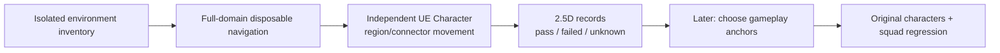

# Pure-map connectivity test workflow

7 October 2026. User-authorized order: write this workflow first, then execute it. [Synchronized Chinese review](PURE_MAP_TEST_WORKFLOW_20261007_ZH.md). Current six actor positions are temporary test placements, not final spawns/objectives/enemy anchors or a survey boundary. This supersedes the earlier recommendation to diagnose occupied-anchor leg8 before surveying pure terrain.

## Scope, failures read and changed mechanism

Read HANDOFF, AGENTS, [failure index](../../../Failures/README.md), [ML001](../../../Failures/ML001-20261007-map-connectivity-fixture/FAILURE_ANALYSIS.md), [NI002](../../../Failures/NI002-20261007-formal-npc-startup/FAILURE_ANALYSIS.md), [NI003](../../../Failures/NI003-20261007-npc-acceptance-fixtures/FAILURE_ANALYSIS.md), retained navigation foundation and current connectivity/height receipts. ML001 mixes occupied goals with terrain movement and lacks a native completion reason. NI003 establishes that hiding a body does not remove collision, projection is not reachability, and class-default navigation wrappers can log ensures. NI002 establishes automatic combat and the need to inspect actual runtime isolation.

Changed mechanism: use a task-owned, unsaved copy of the current loaded environment in memory; remove existing gameplay characters, equipment, grip policies and combat/coordinator actors before PIE, suppress the production GameMode/default pawn, and test with one independent native UE Character/AIController. No old occupied sequence is rerun. Inventory the entire loaded collision domain independently of current placements and the old420m navigation window. Build navigation only in this disposable test world if full-domain coverage requires it; saved map, source assets and configuration remain byte-exact.

Adopt current9ff map and703 protected rows. Check fresh guards/process ownership before every engine entry. No competing/user-owned engine is terminated. Preserve selected FP/Allied/German models, fingers, guns, actions, AI packages and Catalog; no formal save/integration, collision repair, new production NavLink, publication or Git commit/push. Native templates and raw receipts remain private/ignored.

## What “full-map” means

The inventory covers every loaded environment level and records which levels are visible/loaded. Determine bounds from components that actually block Pawn, excluding nonblocking sky/lighting/VFX from the collision denominator. Record all blockers and any distant showcase/proxy geometry; do not silently discard distant islands or infer playable area from actor names. List unloaded levels, streaming omissions and collision surfaces outside navigation as unknown. A bounding rectangle is not a playable-area percentage.

The finite survey denominator is **all generated walkable navigation surfaces represented at an explicit spatial resolution**, including separate surfaces at identical XY, all disconnected components and all inter-region connections. Prefer a complete native Recast polygon/neighbor export; a small read-only editor helper is permitted if Python does not expose it. Group polygons only by XY10m cell and actual within-cell adjacency; never combine stacked layers by rounding Z. Keep every polygon-to-region mapping and cross-region directed adjacency. Choose deterministic representative points and preserve narrower portals/height connectors for inspection. This is resolution-defined coverage, not proof about every square centimetre or all visually accessible interiors.

If a native export is unavailable or a finite surface inventory cannot be established, stop at the inventory/API gate and report the missing capability. Do not call the old coarse grid “full-map.” If the generated navigation fails to cover collision-supported candidate entrances/floors, label them outside-nav/unknown; do not turn them into proven physical disconnections.

## Independent probe specification

Use UE5.8 native `ACharacter` + native `AIController`, with no project combat/behavior/grip inheritance. Its original engine defaults are separately recorded. Installed Epic default mannequin may supply visualization without changing source rigs/materials/weights; it is not a new character-production task. The project's layout baseline uses capsule radius34cm, half-height96.5cm (193cm total), slope45°, step35cm, walking only, stock movement implementation. Record speed/acceleration/gravity/frame-time profile explicitly; no jump, flight, noclip or teleport arrival. Only the capsule blocks; optional template visual mesh does not create another movement collider.

One probe exists during movement, with no original combatants, guns, sensors, behavior trees or runtime policy actors. Record and assert these counts after PIE bootstrap and during batches. Default movement parameters are not automatically acceptance for original FP/Allied/German bodies; their later profile/formation regression is a separate step.

## Execution gates

| Gate | Work and retained output | Acceptance / stop |
| --- | --- | --- |
| P0: isolated inventory | Whole loaded environment/blocking-component bounds; removed actor manifest; native Character defaults; navigation/API/template availability; current guards. No PIE yet. | Source map703 exact; gameplay roster removed in memory; remaining collision belongs to the environment; actual live navigation receiver. API/log ambiguity stops before broad movement. |
| P1: disposable navigation and probe | Suppressed production GameMode; full-domain test bounds/Recast built only in memory; complete surface/neighbor export; probe profile and initial safe standing/capsule checks. | Generation finished;34/193/45 profile; no errors/ensures/registration replacements; original gameplay characters0, probe1. No runtime contamination or source/config mutation. |
| P2: finite connectivity graph | Polygon-to-region mapping, separate stacked surfaces, directed neighbors, components, deterministic independent test cases. | Every exported polygon mapped; no spatial layer merge; absent/partial routes are recorded, not promoted. Report candidate surfaces outside current test navigation. |
| P3: native physical movement | Verify selected region-connecting tree edges in both directions and all additional narrow/vertical/cross-component candidate connections; actual trajectories/results. Each sampled region is visited or explicitly failed/unmeasured. | Native SUCCESS + endpoint XY≤30cm(+5cm measurement margin), foot-height error≤35cm, walking ground contact, no partial path. Record actual frames and move request/result IDs. Native Blocked/Aborted/stall remains failed evidence. |
| P4: audit and2.5D export | XY+realZ/surface identity/component; query/physical/failure/unknown layers; denominator coverage; bounds and height limits; source/data hashes; failed point reasons. | No “all connected” claim if disconnected/failed/unmeasured portions exist. Document the usable measured components rather than adopting mission coordinates. |
| P5: later gameplay layout | Select mission anchors from the accepted component; original role profiles and simultaneous squad bottlenecks. | Deferred until pure-map evidence is reviewed. Current saved placements confer no preferred anchor status. |

## Physical scheduling, failures and initialization

Do not test all region pairs quadratically. The complete native surface graph first identifies components. A deterministic connecting tree supplies a finite bidirectional reachability witness; retain each verified edge and its actual route. Additional narrow/vertical portals require their own explicit cases. Transitive reachability applies only to passed edges with matching surface endpoints/profile. A tree proves mutual access among its accepted sampled regions, not every alternative route or doorway.

Each disconnected component can receive a freshly initialized independent probe at a prechecked standing point. Initialization/spawn/teardown is logged separately from movement and never counts as a passed cross-component connection. After a failed edge, stop that edge without retries/offset searches/tolerance increases; independent predetermined cases may continue after a fresh initialization, preserving the negative edge. Never alter environment collision to manufacture a pass. One-way drops remain directed and must not be turned into reciprocal edges.

Early movement gate: one short outgoing-and-return edge on a verified standing surface, full native completion observation, stable single-probe isolation and original guards. Start broad batches only after this gate. Every batch has a declared finite case list, path-length-derived game timeout, wall-time ceiling and checkpointed results; engine failure does not erase earlier evidence. Performance acceleration, if used, requires a separately declared time/frame profile and does not establish real-time gameplay/FPS acceptance; the initial gate runs at normal time. Stop globally on API/log/ensure errors, source mismatch, contamination, incomplete export, ambiguous floor projection or unbounded simulation. Record physical failures and continue only independent already scheduled cases, never automatic reruns of the same failed mechanism.

## Storage and completion

Before the clean broad writer/entry, read HANDOFF's newer LOCAL recoil increment, Recoil visual plan and AUTHORIZED_LOCAL_BINARIES_20261007.json. Explicitly adopt its3 display DLL hashes through common.py's authenticated allowlist after the immutable678+B+9ff epoch;703 rows/700 others/map/models/actions/AI/Catalog remain exact. Never restore the historical3 hashes. The clean normal reference predates this display-only increment, but contains zero project actors; broad regionXYZ/adjacency and two native Engine-character controls still must match. Snapshot all703 rows/helper/authority hashes per clean broad entry; resume requires the same helper/authority. This is not this task's recoil implementation or publication.

Broad synchronous query starts at the actual capsule feet, matching the native agent start, rather than at its body center that could select an upper surface. Source/goal representatives and initialized body positions remain unchanged. Native MoveTo already uses its agent location; this corrects the query observer without changing movement or retrying an edge. Record Engine BasicShapes Plane/Cube support as existing test geometry, not automatically a Paris mission area; retain it in the inventory rather than deleting it to manufacture a playable component.

Clean fixed batches have a3000s wall budget and stop normally at the next case boundary, keeping unmeasured cases. A next unique entry accepts ONLY a clean partial receipt with normal exit/log0/703 exact, same clean inventory and normal reference, exact frozen regionXYZ/adjacency and ordered prefix case IDs. Carry the original cases/source rejection cache without rerunning failed cases; test separate reproductions of the two already accepted early controls before new cases. Control receipts never inflate the28602-case denominator. The contaminated V5 receipt is ineligible. Compact JSON preserves the same fields without indentation; end audits independently verify schedule uniqueness, native endpoint/completion IDs, frames, template bytes, logs/exit, hashes and guards.

Newest isolation addendum, read [ML005](../../../Failures/ML005-20261007-pure-map-native-isolation/FAILURE_ANALYSIS.md): Native `/Script/ParisGripBindingV18.ParisFirstPersonApprovedActor` escaped the old filters and logs a60-game-second Ready error. Old inventory_v3/Early_v4 and V5's400 observed movements are NOT accepted pure-world evidence. Preserve them without merging their cases into the clean run. Different admission uses inventory_v4/early_lifecycle_v6 after disposable removal of all `/Script/Paris*` gameplay actors, inventory namespace0 and runtime inheritance inspection; original source/bootstrap/map remain untouched. Launcher live-log gate emits an owned stop request; script normally ends PIE/restores/quits. Match numeric native FAIRequestID and controller identity, rather than claiming opaque struct strings are integer IDs. Same movement/body/frame limits. Continue only after these clean gates pass; project contamination/errors still stop globally.

Physical evidence groups contain only endpoints of actually passed edges. Standing-only, failed and unmeasured regions remain separately counted; an isolated vertex of an evidence graph is not proof of physical disconnection. The preserved Early receipt's legacy all-node component count includes unmeasured singletons and must NOT be cited as physical disconnections; derived audits identify the two passed endpoints as one measured evidence group.

Before the first fixed-profile entry, add a read-only exact-native PIE CurrentFloor observation: actual supporting actor/component, impact XYZ/normal, walkable flag, native floor distance and unchanged movement substep limits. Capture it at standing, trajectory samples and arrival; walking ground contact already required by this workflow is explicitly observed. No casts to project characters, source collision/pose mutation or saved map changes. The two normal-time reference receipts remain unchanged and the fixed profile still must reproduce both legs.

Before the first FixedSurvey entry, the measured endpoint-distance lower bound is235.065km/10.883 game hours at600cm/s. Its broad dilation is declared4 with the same20ms application step (80ms world step), still below unchanged100ms ceiling; the first two comparison legs remain dilation1/20ms. This supersedes the earlier unexecuted broad dilation2 capacity estimate only. Record actual frames/native outcomes; no runtime speed/endpoint relaxation or rendering/FPS inference.

Lifecycle/capacity addendum, read [ML004](../../../Failures/ML004-20261007-pure-map-probe-cleanup/FAILURE_ANALYSIS.md): V3 exports the whole finite query graph but its controller cleanup fails; raw physical checkpoint remains0 and owned23472 is forcibly stopped, NOT exit0. All703 guards exact. Next unique `early_lifecycle_v4_20261007` runs only the normal-time pair and must verify native exact-class owned-pair destruction, no accumulated controllers, successful receipt checkpoint, normal exit/log/guard acceptance. Navigation helpers stay read-only; the one runtime cleanup function accepts only the exact native possessed probe/controller pair in PIE. Native world inventory maintains the same isolation checks. End-PIE cleanup errors are recorded without recursive cleanup.

The exported28602-case denominator requires an explicit capacity profile. Only after that rendered normal-time lifecycle gate passes, FixedSurvey uses `-NullRHI -UseFixedTimeStep -FPS=50` (installed LaunchEngineLoop.cpp/UnrealEngine.cpp):20ms application step, early dilation1, broad dilation2/world40ms, same native movement/body and≤0.1s frame gate. Compare every region identity/XYZ and directed adjacency to the normal-time graph, then reproduce its two early legs under unchanged physical endpoint criteria before broad cases. This is fixed-step simulation throughput, not real-time/rendering/FPS acceptance. No teleport arrival or failed-edge retries. Any incomplete finite pass keeps its remaining denominator explicit; normal-time two-leg pass alone is not a full survey.

P1 V2 stops before rebuild/PIE/movement because the Python autosave settings alias is absent; owned30452 closes normally and703 guards remain exact. ML003 retains the raw receipt. The next unique entry uses installed-header reflected class `/Script/UnrealEd.EditorLoadingSavingSettings` and exact field `bAutoSaveEnable`; capture before changing, restore only after capture. This corrects observer setup, not terrain or movement acceptance.

P1 preflight addendum after [ML003](../../../Failures/ML003-20261007-pure-map-nav-preflight/FAILURE_ANALYSIS.md): survey_v1 stops before PIE because async lock0x20 prevents rebuild and vacant capacity refs are misclassified. Next unique entry waits for natural unlock through a read-only native state query, verifies actual registered navigation bounds against requested disposable bounds, then issues one rebuild and waits for completion. Never remove locks. Export active/vacant/empty-ground counters separately, requiring active count match and genuine invalid records0. Recover prior owned helper binaries before replacement. Schedule explicit standing-only initialization checks for isolated/sink regions; these cannot pass a connectivity edge. No terrain/collision correction or admission relaxation.

P0 API addendum after retained [ML002](../../../Failures/ML002-20261007-pure-map-api/FAILURE_ANALYSIS.md): first inventory stops on absent Python CollisionResponse.BLOCK before PIE. Changed preflight reflects and records the unique actual Block enum binding (installed header ECR_Block), rather than guessing a prefix; no collision edits, tolerance/domain changes or movement retry. New unique inventory identity, same703 guards and strict logs, required before P1. Native export groups by real Recast tile XY/layer and within-tile adjacency; native raster layers are surface identities, not floor numbers or fixed Z bins.

The v2 preflight also fails its uniqueness check: CollisionResponse is a struct, not the enum. V3 explicitly reflects CollisionResponseType, as the Epic Python reference and5.8 index specify, and records ECR_BLOCK. An existing city vehicle Pawn is environment, not a removed combatant: retain its original blocking geometry, require no controller/AI and record its stationarity. Runtime isolation counts distinguish that declared environment vehicle from the one Character probe and zero project combatants; do not delete a blocking car to make a route pass.

P0 v3 verified8 loaded levels/14 gameplay actors removed in memory/23037 blocking components, strict errors0/703exact/owned27588exit0. Collision bounds include remote display geometry: XYZ min(−52054.964,−51690.553,−5258.594), max(134160.754,157954.774,125007.267)cm. Include it explicitly rather than silently clipping to the city center. Runtime P1 uses the complete bounds plus100cmXY/193cmZ margins; rebuild only disposable navigation. The independent native probe uses stock600cm/s/2048cm/s²/gravity1 with the declared34/96.5 capsule,35step/45slope. Early pair time dilation1; broad finite cases dilation2 and world frame≤0.1s, recorded per sample. This measures collision/navigation under that declared simulation profile, not300cm/s original-role movement or FPS. Installed Manny Simple+stock unarmed animation are a128-file131381051-byte private default dependency; source template hashes verified and project descriptor unchanged. Native GameModeBase defaults may be staged only in this owned process to suppress default Pawn/HUD, then restored; all project GameMode defaults remain untouched.

Write source/tools/docs/SVG under MissionConnectivityV1/MissionLoopV1; private unique JSON/PNG/log/native template/export artifacts under `Evidence/PureMapSurveyV1/<identity>/` and `tmp/pure-map-survey-v1/`. Snapshot each engine script and dependencies before entry. Record current map/config/template/native-helper/input hashes, executable/process ownership, source guards and actual exit/log audit. Default/template content may be copied into a private dedicated test dependency and mounted without overwriting an existing project mount; no engine installation bytes may be modified.

End PIE, discard unsaved environment/probe/navigation changes, restore any task-owned editor/default settings, close owned engine normally and reverify703 guards. Results are complete only when the declared inventory, query graph, finite movement denominator, failures/unknowns and2.5D diagram are audited. An early gate failure is an explicit stopped test, not a completed full survey or permission to resume an old launcher. Archive any new failure with changed mechanism, actual error, preserved inputs and next distinct bounded work. No final gameplay positions or whole-MVP/course acceptance follow from this work.
