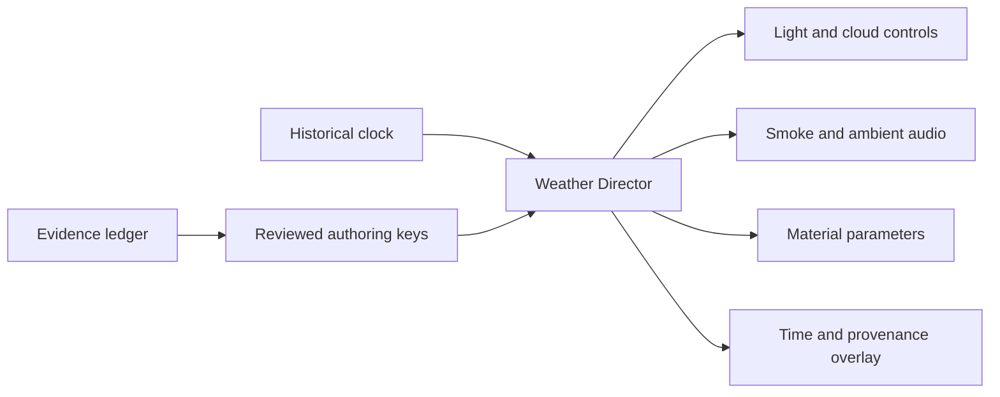

# Blueprint Development Specification

**Confirmed requirement:** use Blueprints as the primary gameplay authoring approach on Yupu Guo's desktop. This document specifies assets and tests; no `.uasset` or Unreal project has been created by this research task. Lock an engine patch version after the first open/package test.

The project retains **Rendering, Animation and Collision Detection** as primary pillars. Historical detail strengthens these pillars. It does not reinstate custom threat-aware A* or introduce a separate weather simulation research project.

For current gameplay scope and midterm gates, use the [Assignment 2 proposal](../Docs/proposal/CS549_Normandy_Assignment2_Proposal.md). Its level uses fixed coastal lighting. Historical-clock and time-varying weather examples below are retained research designs outside the current semester plan, not required Blueprint assets or performance gates.

## Proposed asset responsibilities

| Proposed asset | Owns | Does not own |
|---|---|---|
| `BP_MissionDirector` | Start, objective, reset and mission state | Per-frame material or weapon logic |
| `BP_PlayerCharacter` | Input, movement and camera | Historical evidence database |
| `BPC_Weapon` | Fire/reload validity, clip/ammo state and hit resolution | Animation-only decisions that duplicate ammo ownership |
| `ABP_Soldier` / weapon montages | Locomotion, aim and action pose presentation | Independent damage or ammunition authority |
| `BP_Cover` | Intact/broken state and collision-state broadcast | Arbitrary building destruction |
| `BP_AIController`, small BT/Blackboard | Advance/engage/reposition and route failure recovery | Custom path-search engine |
| `BP_HistoricalClock` | Scenario time, pause, playback rate and deterministic seek | Computer wall-clock weather |
| `BP_WeatherDirector` | Validate/sample authored weather keys; broadcast one weather state | Meteorological forecast generation |
| `MPC_BattlefieldEnvironment` | Shared visual parameters used by selected materials | Historical truth or automatic unit conversion |
| `WBP_TechnicalOverlay` | Clock, weather provenance, animation/collision state and timings | Hidden gameplay authority |

These names are proposed project contracts, not claims that Unreal ships these assets. [Epic Blueprint documentation](https://dev.epicgames.com/documentation/en-us/unreal-engine/blueprints-visual-scripting-in-unreal-engine)

## Weather state and graph flow

Define `ST_WeatherEvidence` separately from `ST_WeatherKey`. Evidence stores source ID, location, original time text/basis, normalized UTC when known, measurement type, range and uncertainty. A key stores **authored** mission time, visual settings and the IDs supporting or constraining them. One evidence row does not automatically become one animation key.

Blueprint numeric fields do not inherently encode missing data. Pair every optional value with a validity flag: `bHasTemperature`, `TemperatureC`, `bHasHumidity`, `RelativeHumidityPct`, `bHasWindRange`, and so on. Import blanks with a dedicated validation step; never allow an empty temperature to become a historical 0°C reading. The ledger has intentionally blank unknown values.

At begin play: validate ascending key times, provenance tags, ranges, and coordinate basis. At a proposed 0.2-second timer interval: sample the clock, find adjacent valid keys, interpolate approved visual controls, then broadcast a single state. Keep the interval tunable and profile it. Avoid many actors separately parsing tables or recomputing the same weather every Tick.

**Wind convention:** meteorological direction describes where wind comes from. Northwest wind carries smoke toward the southeast. Record world north, convert the bearing to the project's axes, and test the sign. In general `FlowVector = -Speed * UnitVectorToward(SourceBearing)`. Do not assume +X is north without a documented world transform.

Do not assume one engine wind actor drives every material, particle and audio system. Explicitly pass the shared flow vector to selected particle parameters and material controls. Sky/cloud density and light intensity remain engine/art parameters, not measured cloud oktas or lux unless calibrated. Temperature/humidity may be shown as unavailable and need not drive any visual effect.

## Minimum labs and acceptance

| Lab | Estimate | Concrete output | Pass criterion |
|---|---|---|---|
| B0: Blueprint project baseline | 4–6 h, excluding installs | Template, graybox, input, restart, packaged build | Opens on primary machine and a teammate can run the package |
| B1: uniform/rank variants | 2–4 h after assets exist | Two data-driven rank variants on one compatible skeleton | Correct insignia locations; role/rank separate; no random faction mixing |
| B2: period weapon presentation | 4–8 h after compatible animations exist | One weapon, correct reload/feed visual, collision-aware firing | Ammo changes exactly once; muzzle and hit logic agree; no incompatible magazine model |
| B3: clock/weather sample | 4–6 h | Two clearly tagged **design** keys, pause and seek, provenance overlay | Reset and seek produce the same sampled state; missing evidence stays unavailable |
| B4: weather/scene integration | 4–6 h | Wind-aligned smoke/audio, lighting/cloud controls | Northwest test flows southeast; visual controls share one state |
| B5: evidence/performance review | 2–3 h | Fixed-camera comparison and timing capture | Settings recorded; changes improve explainability within measured budget |

Estimates are learning/build allowances, not delivery commitments. B1/B2 exclude sourcing, modeling and animation production. If B0 is not stable, do not start B4.

## Scope and performance gates

Build a stable morning preset first. The weather extension is optional until the three pillar labs and mission reset pass. Do not add fluid dynamics, ocean-wave simulation, weather-dependent ballistics, historical forecasting, dynamic mud locomotion, drivable tanks or aircraft combat.

On the RTX 3080, begin packaged testing at 1920×1080 with recorded quality settings and a 60 fps goal (16.7 ms frame budget). This is a proposed target, not a measured result. Compare weather enabled/disabled at the same camera and seed. Record median/p95 frame time, GPU time, working memory and available VRAM telemetry. A proposed incremental weather budget is 1 ms median GPU time; reduce cloud/particle cost if profiling exceeds the agreed budget.

An illustrative demo can show: stable morning scene → collision/cover change → animation state/reload → optional paused time scrub with provenance → return/reset. Label accelerated time as a review mode. Avoid abrupt artistic weather changes being presented as historical observations.
